# Diagrama de Casos de Uso - PASTISSERIE'S DELUXE

Este diagrama representa los casos de uso del sistema de e-commerce de pastelería, organizados por actores (roles).

```mermaid
graph TB
    subgraph Sistema["Sistema PASTISSERIE'S DELUXE"]
        subgraph Autenticacion["Autenticación"]
            UC1[Registrarse]
            UC2[Iniciar Sesión]
            UC3[Recuperar Contraseña]
            UC4[Verificar Email]
        end
        
        subgraph Catalogo["Catálogo de Productos"]
            UC5[Ver Productos]
            UC6[Buscar Productos]
            UC7[Ver Detalles Producto]
            UC8[Ver Reviews]
            UC9[Ver Promociones]
        end
        
        subgraph Carrito["Gestión de Carrito"]
            UC10[Agregar al Carrito]
            UC11[Ver Carrito]
            UC12[Modificar Cantidad]
            UC13[Eliminar del Carrito]
        end
        
        subgraph Pedidos["Gestión de Pedidos"]
            UC14[Crear Pedido]
            UC15[Ver Mis Pedidos]
            UC16[Ver Detalle Pedido]
            UC17[Cancelar Pedido]
            UC18[Crear Reclamación]
        end
        
        subgraph Direcciones["Direcciones de Envío"]
            UC19[Agregar Dirección]
            UC20[Editar Dirección]
            UC21[Eliminar Dirección]
            UC22[Marcar Dirección Predeterminada]
        end
        
        subgraph Reviews["Reseñas"]
            UC23[Crear Review]
            UC24[Editar Review]
            UC25[Eliminar Review]
        end
        
        subgraph AdminProductos["Admin - Productos"]
            UC26[Crear Producto]
            UC27[Editar Producto]
            UC28[Eliminar Producto]
            UC29[Gestionar Stock]
            UC30[Subir Imagen Producto]
            UC31[Gestionar Categorías]
        end
        
        subgraph AdminPromociones["Admin - Promociones"]
            UC32[Crear Promoción]
            UC33[Editar Promoción]
            UC34[Eliminar Promoción]
            UC35[Ver Estadísticas Promociones]
        end
        
        subgraph AdminPedidos["Admin - Pedidos"]
            UC36[Ver Todos los Pedidos]
            UC37[Aprobar Pedido]
            UC38[Asignar Repartidor]
            UC39[Gestionar Reclamaciones]
        end
        
        subgraph AdminReviews["Admin - Reviews"]
            UC40[Aprobar Review]
            UC41[Rechazar Review]
        end
        
        subgraph AdminUsuarios["Admin - Usuarios"]
            UC42[Ver Usuarios]
            UC43[Asignar Rol]
            UC44[Desactivar Usuario]
        end
        
        subgraph AdminConfiguracion["Admin - Configuración"]
            UC45[Editar Configuración Tienda]
            UC46[Gestionar Horarios]
            UC47[Gestionar Costos Envío]
        end
        
        subgraph Repartidor["Repartidor - Entregas"]
            UC48[Ver Pedidos Asignados]
            UC49[Ver Mapa con Direcciones]
            UC50[Marcar Pedido como Entregado]
            UC51[Marcar Pedido como No Entregado]
            UC52[Ver Historial Entregas]
        end
        
        subgraph Notificaciones["Notificaciones"]
            UC53[Ver Notificaciones]
            UC54[Marcar Notificación Leída]
        end
    end
    
    Cliente([Cliente/Usuario])
    Admin([Administrador])
    Repartidor_Actor([Repartidor])
    
    Cliente --> UC1
    Cliente --> UC2
    Cliente --> UC3
    Cliente --> UC4
    Cliente --> UC5
    Cliente --> UC6
    Cliente --> UC7
    Cliente --> UC8
    Cliente --> UC9
    Cliente --> UC10
    Cliente --> UC11
    Cliente --> UC12
    Cliente --> UC13
    Cliente --> UC14
    Cliente --> UC15
    Cliente --> UC16
    Cliente --> UC17
    Cliente --> UC18
    Cliente --> UC19
    Cliente --> UC20
    Cliente --> UC21
    Cliente --> UC22
    Cliente --> UC23
    Cliente --> UC24
    Cliente --> UC25
    Cliente --> UC53
    Cliente --> UC54
    
    Admin --> UC26
    Admin --> UC27
    Admin --> UC28
    Admin --> UC29
    Admin --> UC30
    Admin --> UC31
    Admin --> UC32
    Admin --> UC33
    Admin --> UC34
    Admin --> UC35
    Admin --> UC36
    Admin --> UC37
    Admin --> UC38
    Admin --> UC39
    Admin --> UC40
    Admin --> UC41
    Admin --> UC42
    Admin --> UC43
    Admin --> UC44
    Admin --> UC45
    Admin --> UC46
    Admin --> UC47
    Admin --> UC53
    Admin --> UC54
    
    Repartidor_Actor --> UC48
    Repartidor_Actor --> UC49
    Repartidor_Actor --> UC50
    Repartidor_Actor --> UC51
    Repartidor_Actor --> UC52
    Repartidor_Actor --> UC53
    Repartidor_Actor --> UC54
    
    style Sistema fill:#fff5f5,stroke:#ff6b6b,stroke-width:3px
    style Cliente fill:#e3f2fd,stroke:#1976d2,stroke-width:2px
    style Admin fill:#fff3e0,stroke:#f57c00,stroke-width:2px
    style Repartidor_Actor fill:#e8f5e9,stroke:#388e3c,stroke-width:2px
```

## Actores del Sistema

### 1. Cliente/Usuario (Usuario Autenticado)
Usuario registrado que puede navegar el catálogo, realizar compras, gestionar su carrito, direcciones de envío, y escribir reseñas.

**Casos de uso principales**:
- Gestión de cuenta (registro, login, recuperación contraseña)
- Navegación de catálogo y promociones
- Gestión de carrito de compras
- Creación y seguimiento de pedidos
- Gestión de direcciones de envío
- Creación y gestión de reviews
- Visualización de notificaciones

### 2. Administrador (Admin)
Rol administrativo con acceso completo a todas las funcionalidades del sistema.

**Casos de uso principales**:
- CRUD completo de productos, categorías y promociones
- Aprobación y asignación de pedidos a repartidores
- Gestión de reclamaciones
- Moderación de reviews (aprobar/rechazar)
- Gestión de usuarios y roles
- Configuración general de la tienda (horarios, costos de envío, etc.)
- Subida de imágenes a Azure Blob Storage

### 3. Repartidor (Delivery)
Rol especializado para gestión de entregas de pedidos.

**Casos de uso principales**:
- Visualización de pedidos asignados
- Mapa interactivo con direcciones de entrega (Google Maps con coordenadas GPS)
- Marcado de pedidos como entregados o no entregados
- Registro de motivos de no entrega
- Historial de entregas realizadas
- Visualización de notificaciones

## Flujos Principales

### Flujo de Compra (Cliente)
1. Ver Productos → Ver Detalles → Ver Reviews
2. Agregar al Carrito → Ver Carrito → Modificar Cantidad
3. Agregar/Seleccionar Dirección de Envío
4. Crear Pedido → Ver Mis Pedidos → Ver Detalle Pedido
5. (Opcional) Crear Reclamación si hay problemas

### Flujo de Gestión de Pedidos (Admin)
1. Ver Todos los Pedidos
2. Aprobar Pedido
3. Asignar Repartidor
4. (Si hay reclamación) Gestionar Reclamaciones

### Flujo de Entrega (Repartidor)
1. Ver Pedidos Asignados
2. Ver Mapa con Direcciones (GPS)
3. Marcar Pedido como Entregado / No Entregado
4. (Si no entrega) Sistema crea automáticamente Reclamación

## Notas Técnicas

- Todos los roles reciben **Notificaciones** automáticas del sistema
- El sistema usa **JWT con roles** para control de acceso (Usuario, Admin, Repartidor)
- Las **Reviews** requieren aprobación administrativa antes de ser públicas
- Los **Pedidos** pasan por estados: Pendiente → Aprobado → EnCamino → Entregado / NoEntregado
- Las **Direcciones** soportan coordenadas GPS (Latitud/Longitud) para integración con Google Maps
- Las **Imágenes** se suben a **Azure Blob Storage** (no almacenamiento local)
- El sistema valida **horarios laborales** y **compra mínima** antes de permitir checkout

## Generado
- **Fecha**: 03/04/2026
- **Versión**: 1.0
- **Estado**: Refleja código actual al 03/04/2026
