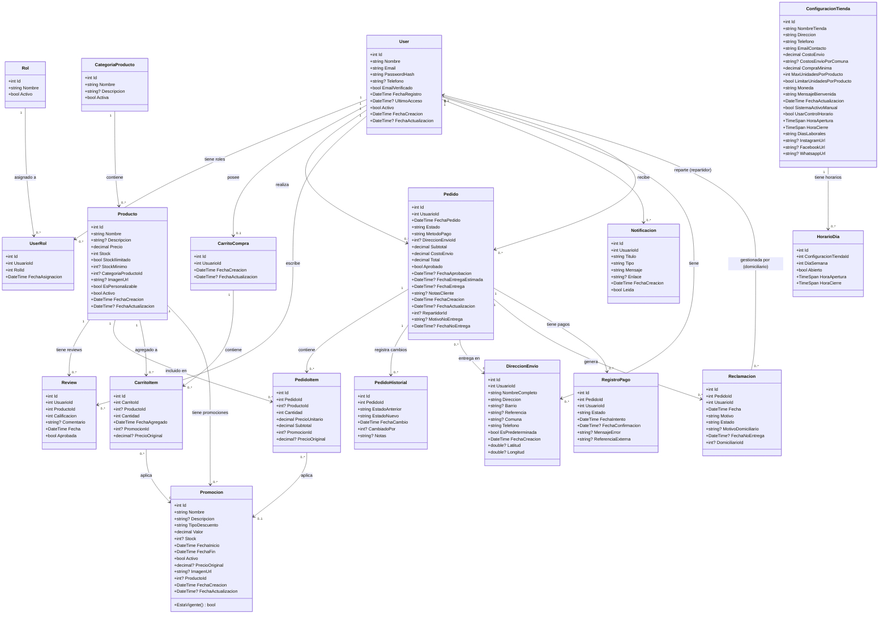

# Diagrama de Clases - PASTISSERIE'S DELUXE

Este diagrama representa el modelo de dominio completo del sistema, con las 18 entidades actuales y sus relaciones.

## Descripción de Entidades

### Módulo de Autenticación y Usuarios

#### User
Entidad principal que representa a todos los usuarios del sistema (clientes, administradores, repartidores).

**Características clave**:
- Email único con validación
- PasswordHash (bcrypt) para seguridad
- EmailVerificado para confirmación de cuenta
- Activo para soft-delete
- Soporta múltiples roles mediante UserRol (relación N:N con Rol)

#### Rol
Define los 3 roles del sistema: Usuario, Admin, Repartidor.

**Datos semilla**:
- Id 1: Usuario (cliente estándar)
- Id 2: Admin (administrador total)
- Id 3: Repartidor (delivery)

#### UserRol
Tabla intermedia que relaciona User con Rol (muchos a muchos).

### Módulo de Catálogo

#### Producto
Representa cada producto disponible en la tienda.

**Características clave**:
- **StockIlimitado**: Si es true, ignora validación de Stock (agregado 02/04/2026)
- **ImagenUrl**: Ruta en Azure Blob Storage (no almacenamiento local)
- **EsPersonalizable**: Indica si permite personalización (funcionalidad futura)
- Relación opcional con CategoriaProducto

#### CategoriaProducto
Clasificación de productos (ej: Tortas, Postres, Galletas).

### Módulo de Carrito de Compras

#### CarritoCompra
Carrito persistente asociado a cada usuario (1:1).

#### CarritoItem
Ítems individuales dentro del carrito.

**Características clave**:
- **ProductoId nullable**: Soporta promociones independientes sin producto asociado
- **PromocionId**: Relaciona con promoción aplicada
- **PrecioOriginal**: Guarda precio antes del descuento

### Módulo de Pedidos

#### Pedido
Representa una orden de compra realizada por un usuario.

**Características clave**:
- **Estado**: Pendiente, Aprobado, EnCamino, Entregado, Cancelado, NoEntregado
- **MetodoPago**: String simple (Efectivo, Nequi, etc.) - simplificado en marzo 2026
- **RepartidorId**: Asignación de repartidor (FK a User con rol Repartidor)
- **MotivoNoEntrega + FechaNoEntrega**: Campos para entregas fallidas
- **DireccionEnvioId**: Relación con DireccionEnvio (incluye GPS)

#### PedidoItem
Línea de detalle del pedido (productos + cantidades + precios).

**Características clave**:
- **ProductoId nullable**: Soporta promociones independientes
- **PrecioUnitario**: Precio al momento de la compra (snapshot)
- **PromocionId + PrecioOriginal**: Tracking de descuentos aplicados

#### PedidoHistorial
Auditoría de cambios de estado del pedido.

**Campos**:
- EstadoAnterior → EstadoNuevo
- FechaCambio
- CambiadoPor (ID del usuario que hizo el cambio)
- Notas opcionales

### Módulo de Entregas

#### DireccionEnvio
Direcciones de envío de los usuarios.

**Características clave** (agregadas 02/04/2026):
- **Latitud + Longitud**: Coordenadas GPS para Google Maps
- **EsPredeterminada**: Marca dirección default para checkout
- **Comuna**: Usada para calcular costo de envío diferenciado

### Módulo de Reviews

#### Review
Reseñas de productos escritas por usuarios.

**Características clave**:
- **Calificacion**: 1-5 estrellas (validado con [Range(1,5)])
- **Aprobada**: Moderación administrativa (false por defecto)

### Módulo de Promociones

#### Promocion
Descuentos aplicables a productos o como promociones independientes.

**Características clave**:
- **TipoDescuento**: "Porcentaje" o "MontoFijo"
- **Valor**: Monto del descuento
- **FechaInicio + FechaFin**: Vigencia temporal
- **ProductoId nullable**: Si es null, la promoción es independiente (usa ImagenUrl propia)
- **Stock**: Para promociones independientes (en productos se usa el stock del producto)
- **Método EstaVigente()**: Valida si está activa y dentro del rango de fechas

### Módulo de Notificaciones

#### Notificacion
Alertas enviadas a usuarios (pedidos aprobados, cambios de estado, etc.).

**Características clave**:
- **Tipo**: Categoriza la notificación (Pedido, Sistema, Promocion, etc.)
- **Enlace**: URL opcional para navegación directa
- **Leida**: Estado de lectura

### Módulo de Reclamaciones

#### Reclamacion
Quejas o reportes sobre pedidos.

**Características clave**:
- **Estado**: Pendiente, EnRevision, Resuelta, Rechazada
- **MotivoDomiciliario + FechaNoEntrega + DomiciliarioId**: Se llenan automáticamente cuando un repartidor marca un pedido como "No Entregado"

### Módulo de Pagos

#### RegistroPago
Log de intentos de pago y confirmaciones.

**Estados**:
- Espera: Pago pendiente
- Exitoso: Confirmado
- Fallido: Error en el proceso

### Módulo de Configuración

#### ConfiguracionTienda
Configuración global del sistema (singleton - solo 1 registro).

**Características clave**:
- **CostosEnvioPorComuna**: JSON con costos diferenciados por zona
- **CompraMinima**: Monto mínimo para checkout (default: $15,000 COP)
- **MaxUnidadesPorProducto**: Límite de unidades por producto (default: 10)
- **SistemaActivoManual + UsarControlHorario**: Control de apertura/cierre
- **HoraApertura + HoraCierre + DiasLaborales**: Horario laboral base
- Redes sociales (Instagram, Facebook, WhatsApp)

#### HorarioDia
Horarios específicos por día de la semana (0=Domingo, 1=Lunes, ..., 6=Sábado).

**Características**:
- Sobreescribe el horario base de ConfiguracionTienda
- Permite cerrar días específicos (Abierto = false)

## Relaciones Clave

### Relaciones User (1:N)
- User → UserRol (roles múltiples)
- User → CarritoCompra (1:1, cada usuario tiene 1 carrito)
- User → Pedido (como cliente)
- User → Pedido (como repartidor, FK: RepartidorId)
- User → Review
- User → Notificacion
- User → DireccionEnvio

### Relaciones Producto (1:N)
- CategoriaProducto → Producto
- Producto → Review
- Producto → PedidoItem
- Producto → CarritoItem
- Producto → Promocion (0..1 - opcional)

### Relaciones Pedido (1:N)
- User → Pedido (UsuarioId)
- User → Pedido (RepartidorId)
- DireccionEnvio → Pedido
- Pedido → PedidoItem
- Pedido → PedidoHistorial
- Pedido → Reclamacion
- Pedido → RegistroPago

### Relaciones Opcionales (0..1)
- Producto → CategoriaProducto (puede no tener categoría)
- Promocion → Producto (promoción independiente si es null)
- CarritoItem → Promocion (item sin descuento si es null)
- PedidoItem → Promocion (item sin descuento si es null)
- Pedido → DireccionEnvio (puede ser null si es retiro en tienda)
- Reclamacion → User (DomiciliarioId - solo si viene de "No Entregado")

## Cambios Recientes (Marzo 2026)

### ❌ Entidades Eliminadas
- **Factura**: Reemplazada por RegistroPago simplificado
- **Envios**: Datos absorbidos por Pedido (campos RepartidorId, FechaEntrega, etc.)
- **MetodosPagoUsuario + TiposMetodoPago**: Reemplazadas por campo string MetodoPago en Pedido
- **Personalización**: Funcionalidad pospuesta (flag EsPersonalizable en Producto)

### ✅ Campos Agregados
- **Producto.StockIlimitado** (02/04/2026): Inventario infinito
- **DireccionEnvio.Latitud + Longitud** (02/04/2026): GPS para Google Maps
- **Pedido.RepartidorId + MotivoNoEntrega + FechaNoEntrega**: Tracking de entregas
- **CarritoItem.PromocionId + PrecioOriginal**: Soporte de promociones
- **PedidoItem.PromocionId + PrecioOriginal**: Soporte de promociones

### 🔄 Campos Simplificados
- **Pedido.MetodoPago**: De FK a string simple
- **Pedido**: Eliminados IVA, MetodoPagoId (marzo 2026)
- **User**: Eliminado Direccion (migrado a DireccionEnvio)

## Convenciones de Diseño

### Nomenclatura
- **Claves primarias**: `Id` (int, auto-incremental)
- **Claves foráneas**: `{Entidad}Id` (ej: UsuarioId, ProductoId)
- **Fechas**: Prefijo `Fecha` (ej: FechaCreacion)
- **Booleanos**: Sin prefijo `Is` (ej: Activo, Aprobado, Leida)

### Tipos de Datos
- **Decimales monetarios**: `decimal(18,2)`
- **Fechas/Horas**: `DateTime` (UTC en backend)
- **Strings largos**: `MaxLength(1000)` para textos
- **Strings cortos**: `MaxLength(50-200)` para nombres/títulos

### Validaciones
- **Required**: En campos obligatorios
- **MaxLength**: En todos los strings
- **EmailAddress**: En campos de email
- **Range**: En campos numéricos con límites (ej: Calificacion 1-5)

### Relaciones EF Core
- **virtual**: Propiedades de navegación para lazy loading
- **ForeignKey**: Atributo explícito en relaciones
- **ICollection**: Para relaciones 1:N

## Generado
- **Fecha**: 03/04/2026
- **Versión**: 1.0
- **Estado**: Refleja 18 entidades actuales al 03/04/2026
