# Diagrama de Componentes - PASTISSERIE'S DELUXE

Este diagrama representa la arquitectura de componentes del sistema, basado en Clean Architecture.

```mermaid
graph TB
    subgraph Cliente["Cliente (Navegador)"]
        Browser[React 19 App<br/>TypeScript + Vite<br/>Tailwind CSS v4]
        ReactRouter[React Router v7]
        AuthContext[AuthContext]
        CartContext[CartContext]
        ApiClient[Axios HTTP Client]
    end
    
    subgraph Frontend["Frontend Services"]
        AuthService[authService.ts]
        ProductoService[productoService.ts]
        CarritoService[carritoService.ts]
        PedidoService[pedidoService.ts]
        UploadService[uploadService.ts]
    end
    
    subgraph Backend["Backend (ASP.NET Core 8.0)"]
        subgraph API["API Layer (Controllers)"]
            AuthController[AuthController]
            ProductoController[ProductoController]
            CarritoController[CarritoController]
            PedidoController[PedidoController]
            ReviewController[ReviewController]
            PromocionController[PromocionController]
            UploadController[UploadController]
            ConfigController[ConfiguracionController]
            NotificacionController[NotificacionController]
            ReclamacionController[ReclamacionController]
            RolController[RolController]
            CategoriaController[CategoriaController]
            DireccionController[DireccionEnvioController]
            UserController[UserController]
            DashboardController[DashboardController]
        end
        
        subgraph Middleware["Middleware"]
            GlobalException[GlobalExceptionMiddleware]
            JwtMiddleware[JWT Authentication]
            CorsMiddleware[CORS Policy]
        end
        
        subgraph Services["Services Layer (Business Logic)"]
            AuthSvc[AuthService]
            ProductoSvc[ProductoService]
            CarritoSvc[CarritoService]
            PedidoSvc[PedidoService]
            ReviewSvc[ReviewService]
            PromocionSvc[PromocionService]
            BlobStorageSvc[BlobStorageService]
            ConfigSvc[ConfiguracionService]
            NotificacionSvc[NotificacionService]
            ReclamacionSvc[ReclamacionService]
        end
        
        subgraph DTOs["DTOs + Validators"]
            RequestDtos[Request DTOs]
            ResponseDtos[Response DTOs]
            FluentValidators[FluentValidation Validators]
            AutoMapper[AutoMapper Profiles]
        end
        
        subgraph Infrastructure["Infrastructure Layer"]
            UnitOfWork[UnitOfWork]
            Repositories[Repositories<br/>UserRepository<br/>ProductoRepository<br/>PedidoRepository<br/>etc.]
            DbContext[ApplicationDbContext<br/>Entity Framework Core]
        end
        
        subgraph Core["Core Layer (Domain)"]
            Entities[Entities<br/>User, Producto, Pedido<br/>Review, Promocion, etc.]
            Enums[Enums<br/>EstadoPedido<br/>TipoRol<br/>TipoNotificacion]
            Interfaces[Interfaces<br/>IRepository<br/>IUnitOfWork<br/>IAuthService<br/>etc.]
        end
    end
    
    subgraph External["Servicios Externos"]
        Database[(SQL Server<br/>PastisserieDB)]
        AzureBlob[Azure Blob Storage<br/>Imágenes de productos]
        SMTP[SMTP Server<br/>Gmail]
    end
    
    %% Conexiones Frontend
    Browser --> ReactRouter
    Browser --> AuthContext
    Browser --> CartContext
    Browser --> ApiClient
    
    ApiClient --> AuthService
    ApiClient --> ProductoService
    ApiClient --> CarritoService
    ApiClient --> PedidoService
    ApiClient --> UploadService
    
    %% Conexiones Frontend → Backend
    AuthService -.HTTP/JSON.-> AuthController
    ProductoService -.HTTP/JSON.-> ProductoController
    CarritoService -.HTTP/JSON.-> CarritoController
    PedidoService -.HTTP/JSON.-> PedidoController
    UploadService -.HTTP/JSON.-> UploadController
    
    %% Middleware Flow
    AuthController --> JwtMiddleware
    ProductoController --> JwtMiddleware
    CarritoController --> JwtMiddleware
    PedidoController --> JwtMiddleware
    ReviewController --> JwtMiddleware
    PromocionController --> JwtMiddleware
    UploadController --> JwtMiddleware
    ConfigController --> JwtMiddleware
    NotificacionController --> JwtMiddleware
    ReclamacionController --> JwtMiddleware
    RolController --> JwtMiddleware
    CategoriaController --> JwtMiddleware
    DireccionController --> JwtMiddleware
    UserController --> JwtMiddleware
    DashboardController --> JwtMiddleware
    
    JwtMiddleware --> GlobalException
    GlobalException --> CorsMiddleware
    
    %% Controllers → Services
    AuthController --> AuthSvc
    ProductoController --> ProductoSvc
    CarritoController --> CarritoSvc
    PedidoController --> PedidoSvc
    ReviewController --> ReviewSvc
    PromocionController --> PromocionSvc
    UploadController --> BlobStorageSvc
    ConfigController --> ConfigSvc
    NotificacionController --> NotificacionSvc
    ReclamacionController --> ReclamacionSvc
    
    %% Services → DTOs + Validators
    AuthSvc --> RequestDtos
    AuthSvc --> ResponseDtos
    AuthSvc --> FluentValidators
    AuthSvc --> AutoMapper
    ProductoSvc --> RequestDtos
    ProductoSvc --> ResponseDtos
    ProductoSvc --> AutoMapper
    
    %% Services → Infrastructure
    AuthSvc --> UnitOfWork
    ProductoSvc --> UnitOfWork
    CarritoSvc --> UnitOfWork
    PedidoSvc --> UnitOfWork
    ReviewSvc --> UnitOfWork
    PromocionSvc --> UnitOfWork
    ConfigSvc --> UnitOfWork
    NotificacionSvc --> UnitOfWork
    ReclamacionSvc --> UnitOfWork
    
    %% Infrastructure → Core
    UnitOfWork --> Repositories
    Repositories --> DbContext
    DbContext --> Entities
    Repositories --> Interfaces
    
    %% External Services
    DbContext -.EF Core.-> Database
    BlobStorageSvc -.Azure SDK.-> AzureBlob
    AuthSvc -.SMTP.-> SMTP
    
    %% Styling
    style Cliente fill:#e3f2fd,stroke:#1976d2,stroke-width:3px
    style Frontend fill:#f3e5f5,stroke:#7b1fa2,stroke-width:2px
    style Backend fill:#fff3e0,stroke:#f57c00,stroke-width:3px
    style External fill:#e8f5e9,stroke:#388e3c,stroke-width:2px
    
    style API fill:#ffebee,stroke:#c62828,stroke-width:2px
    style Middleware fill:#fce4ec,stroke:#ad1457,stroke-width:2px
    style Services fill:#fff9c4,stroke:#f57f17,stroke-width:2px
    style DTOs fill:#f0f4c3,stroke:#9e9d24,stroke-width:2px
    style Infrastructure fill:#e0f2f1,stroke:#00695c,stroke-width:2px
    style Core fill:#e1f5fe,stroke:#01579b,stroke-width:2px
```



## Descripción de Componentes

### Cliente (Frontend)

#### React 19 App
Single Page Application (SPA) construida con:
- **React 19**: Framework de UI
- **TypeScript**: Tipado estático
- **Vite**: Build tool y dev server ultra-rápido
- **Tailwind CSS v4**: Framework de CSS utility-first
- **Recharts**: Gráficos para dashboards

**Características**:
- Hot Module Replacement (HMR)
- Code splitting automático
- Tree shaking
- Optimización de assets

#### React Router v7
Manejo de rutas del frontend:
- Rutas públicas: `/`, `/login`, `/register`, `/productos`
- Rutas protegidas (cliente): `/carrito`, `/mis-pedidos`, `/perfil`
- Rutas protegidas (admin): `/admin/*`
- Rutas protegidas (repartidor): `/repartidor/*`

#### Context API
**AuthContext**:
- Almacena estado de autenticación (user, token, roles)
- Provee métodos: `login()`, `logout()`, `checkAuth()`
- Persiste token en `localStorage`

**CartContext**:
- Gestiona estado del carrito de compras
- Provee métodos: `addToCart()`, `removeFromCart()`, `updateQuantity()`, `clearCart()`
- Sincroniza con backend

#### Axios HTTP Client
Cliente HTTP configurado con:
- Base URL: `http://localhost:5000` (dev) / `{PRODUCTION_URL}` (prod)
- Interceptors:
  - Request: Agrega header `Authorization: Bearer {token}`
  - Response: Manejo de errores 401 (logout automático), 403 (acceso denegado)

### Frontend Services

Capa de abstracción para comunicación con backend. Cada servicio mapea a un controlador:

| Service | Controller | Endpoints |
|---------|-----------|-----------|
| authService.ts | AuthController | `/api/auth/*` |
| productoService.ts | ProductoController | `/api/producto/*` |
| carritoService.ts | CarritoController | `/api/carrito/*` |
| pedidoService.ts | PedidoController | `/api/pedido/*` |
| uploadService.ts | UploadController | `/api/upload/*` |

**Patrón de uso**:
```typescript
// Frontend component
const productos = await productoService.getAll();
```

### Backend - API Layer (Controllers)

15 controladores REST que implementan endpoints HTTP:

#### AuthController
- `POST /api/auth/register`: Registro de usuario
- `POST /api/auth/login`: Login y generación de JWT
- `POST /api/auth/forgot-password`: Envío de email de recuperación
- `POST /api/auth/reset-password`: Reset de contraseña con token

#### ProductoController
- `GET /api/producto`: Listar productos activos
- `GET /api/producto/{id}`: Detalle de producto
- `POST /api/producto`: Crear producto (Admin)
- `PUT /api/producto/{id}`: Editar producto (Admin)
- `DELETE /api/producto/{id}`: Soft delete (Admin)

#### PedidoController
- `GET /api/pedido/usuario`: Pedidos del usuario autenticado
- `GET /api/pedido/todos`: Todos los pedidos (Admin)
- `GET /api/pedido/mis-asignaciones`: Pedidos del repartidor autenticado
- `POST /api/pedido/crear`: Crear pedido desde carrito
- `PUT /api/pedido/{id}/aprobar`: Aprobar pedido (Admin)
- `PUT /api/pedido/{id}/asignar-repartidor`: Asignar repartidor (Admin)
- `PUT /api/pedido/{id}/marcar-entregado`: Marcar como entregado (Repartidor)
- `PUT /api/pedido/{id}/marcar-no-entregado`: Marcar como no entregado (Repartidor)

*(Otros controladores siguen el mismo patrón RESTful)*

### Backend - Middleware

#### GlobalExceptionMiddleware
Manejo centralizado de excepciones:
- Captura todas las excepciones no controladas
- Retorna respuestas estandarizadas: `ApiResponse<T>.ErrorResponse(message)`
- Logging de errores
- Previene exposición de detalles sensibles en producción

#### JWT Authentication
Middleware de ASP.NET Core para validación de tokens:
- Valida firma del token
- Extrae claims (UserId, Email, Roles)
- Inyecta `User` en `HttpContext` para uso en controllers

#### CORS Policy
Configuración para permitir requests desde frontend:
- **Origins**: `http://localhost:5173` (dev), `{FRONTEND_URL}` (prod)
- **Methods**: GET, POST, PUT, DELETE, OPTIONS
- **Headers**: Authorization, Content-Type

### Backend - Services Layer

Lógica de negocio separada de los controllers. Implementan interfaces definidas en Core.

#### Características:
- **Inyección de dependencias**: Reciben `IUnitOfWork` en constructor
- **Validación de negocio**: Validaciones complejas más allá de FluentValidation
- **Orquestación**: Coordinan múltiples repositorios en transacciones
- **Mapeo**: Usan AutoMapper para convertir Entities ↔ DTOs

**Ejemplo**:
```csharp
public class PedidoService : IPedidoService
{
    private readonly IUnitOfWork _unitOfWork;
    private readonly IMapper _mapper;
    
    public async Task<PedidoResponseDto> CrearPedidoAsync(int userId)
    {
        // 1. Validación: verificar carrito no vacío
        // 2. Calcular totales
        // 3. Crear Pedido + PedidoItems
        // 4. Actualizar stock de productos
        // 5. Vaciar carrito
        // 6. Crear notificación
        // 7. Commit transacción
    }
}
```

#### BlobStorageService
Servicio especializado para Azure Blob Storage:
- Sube imágenes a contenedor "productos"
- Genera nombres únicos (GUID)
- Retorna URL pública del blob
- No usa base de datos (stateless)

### Backend - DTOs + Validators

#### Request DTOs
Objetos que reciben datos del cliente:
- `RegisterRequestDto`: { Nombre, Email, Password, ConfirmPassword, Telefono }
- `LoginRequestDto`: { Email, Password }
- `CreateProductoDto`: { Nombre, Descripcion, Precio, Stock, CategoriaId, ImagenUrl }

#### Response DTOs
Objetos que retornan al cliente:
- `UserResponseDto`: { Id, Nombre, Email, Telefono, Roles, FechaRegistro }
- `ProductoResponseDto`: { Id, Nombre, Precio, Stock, ImagenUrl, Categoria }

#### FluentValidation Validators
Validadores automáticos asociados a DTOs:
```csharp
public class RegisterRequestDtoValidator : AbstractValidator<RegisterRequestDto>
{
    public RegisterRequestDtoValidator()
    {
        RuleFor(x => x.Email).NotEmpty().EmailAddress();
        RuleFor(x => x.Password).MinimumLength(6);
        RuleFor(x => x.ConfirmPassword).Equal(x => x.Password);
    }
}
```

#### AutoMapper
Configuración de mapeos Entities ↔ DTOs:
```csharp
CreateMap<User, UserResponseDto>()
    .ForMember(dest => dest.Roles, opt => opt.MapFrom(src => src.UserRoles.Select(ur => ur.Rol.Nombre)));
```

### Backend - Infrastructure Layer

#### UnitOfWork
Implementa patrón Unit of Work:
- Expone todos los repositorios: `Users`, `Productos`, `Pedidos`, etc.
- Coordina transacciones: Un solo `SaveChangesAsync()` al final
- Garantiza atomicidad

```csharp
public interface IUnitOfWork
{
    IUserRepository Users { get; }
    IProductoRepository Productos { get; }
    IPedidoRepository Pedidos { get; }
    // ... otros repositorios
    Task<int> SaveChangesAsync();
}
```

#### Repositories
Implementaciones concretas de `IRepository<T>`:
- Métodos CRUD genéricos: `GetByIdAsync()`, `GetAllAsync()`, `AddAsync()`, `Update()`, `Delete()`
- Métodos específicos por entidad: `GetByEmailAsync()`, `GetActiveProductsAsync()`
- Usan EF Core Linq queries

#### ApplicationDbContext
DbContext de Entity Framework Core:
- Conexión a SQL Server
- 18 DbSet<> (uno por entidad)
- Configuración de relaciones (FluentAPI)
- Migraciones automáticas

```csharp
public class ApplicationDbContext : DbContext
{
    public DbSet<User> Users { get; set; }
    public DbSet<Producto> Productos { get; set; }
    // ... 16 DbSets más
    
    protected override void OnModelCreating(ModelBuilder modelBuilder)
    {
        // Configuración de relaciones, índices, etc.
    }
}
```

### Backend - Core Layer

#### Entities
18 clases de dominio (POCO - Plain Old CLR Objects):
- User, Rol, UserRol
- Producto, CategoriaProducto
- Pedido, PedidoItem, PedidoHistorial
- CarritoCompra, CarritoItem
- Review, Promocion, Notificacion
- DireccionEnvio, Reclamacion, RegistroPago
- ConfiguracionTienda, HorarioDia

**Sin lógica de negocio** (solo propiedades + DataAnnotations).

#### Enums
Enumeraciones para valores constantes:
```csharp
public enum EstadoPedido
{
    Pendiente, Aprobado, EnCamino, Entregado, Cancelado, NoEntregado
}

public enum TipoRol
{
    Usuario = 1, Admin = 2, Repartidor = 3
}

public enum TipoNotificacion
{
    Pedido, Sistema, Promocion
}
```

#### Interfaces
Contratos que definen comportamientos:
- `IRepository<T>`: Operaciones CRUD genéricas
- `IUnitOfWork`: Acceso a repositorios + transacciones
- `IAuthService`, `IProductoService`, etc.: Servicios de negocio

### Servicios Externos

#### SQL Server (PastisserieDB)
Base de datos relacional:
- 18 tablas (una por entidad)
- Constraints: FOREIGN KEY, UNIQUE, CHECK
- Índices en campos de búsqueda (Email, Estado, UsuarioId)
- 33 migraciones aplicadas (última: 03/04/2026)

#### Azure Blob Storage
Almacenamiento de imágenes:
- Contenedor: "productos"
- URL pública: `https://{storage-account}.blob.core.windows.net/productos/{guid}.jpg`
- No requiere autenticación para lectura (blob público)

#### SMTP Server (Gmail)
Envío de emails:
- Recuperación de contraseña (reset token)
- Confirmación de registro (futuro)
- Notificaciones por email (futuro)

## Flujo de Datos

### Request (Cliente → Backend)
1. **React Component** dispara acción (ej: submit form)
2. **Service** (ej: `authService.login()`) hace HTTP request con Axios
3. **Axios** agrega header `Authorization` (si existe token)
4. Request llega a **Controller** (ej: `AuthController.Login()`)
5. **Middleware** valida JWT, CORS, manejo de excepciones
6. **Controller** llama a **Service** (ej: `_authService.LoginAsync()`)
7. **Service** valida con **FluentValidation**, usa **UnitOfWork**
8. **UnitOfWork** accede a **Repository** específico
9. **Repository** ejecuta query con **DbContext** (EF Core)
10. **DbContext** traduce a SQL y consulta **SQL Server**

### Response (Backend → Cliente)
1. **Database** retorna datos
2. **Repository** retorna Entity
3. **Service** mapea Entity → DTO con **AutoMapper**
4. **Service** retorna DTO
5. **Controller** envuelve en `ApiResponse<T>.SuccessResponse()`
6. **Middleware** serializa a JSON
7. Response HTTP retorna al cliente
8. **Axios** interceptor procesa respuesta
9. **Service** retorna datos a **Component**
10. **Component** actualiza estado (useState/Context)
11. **React** re-renderiza UI

## Patrones de Diseño Aplicados

### Clean Architecture (Arquitectura Limpia)
Capas concéntricas con dependencias hacia adentro:
- **Core** (centro): Entidades + Interfaces (sin dependencias externas)
- **Infrastructure**: Implementa interfaces de Core (depende de Core)
- **Services**: Lógica de negocio (depende de Core + Infrastructure)
- **API**: Controllers (depende de Services)

**Beneficios**:
- Independencia de frameworks
- Testabilidad (fácil crear mocks de interfaces)
- Separación de responsabilidades

### Repository Pattern
Abstrae acceso a datos:
```csharp
IUserRepository users = _unitOfWork.Users;
var user = await users.GetByEmailAsync("user@example.com");
```

**Beneficios**:
- Cambiar ORM (EF Core → Dapper) sin afectar Services
- Testing (mock del repository)

### Unit of Work
Agrupa operaciones en una transacción:
```csharp
await _unitOfWork.Productos.AddAsync(producto);
await _unitOfWork.SaveChangesAsync(); // Una sola transacción
```

### Dependency Injection (DI)
ASP.NET Core DI container:
```csharp
// Program.cs
builder.Services.AddScoped<IUnitOfWork, UnitOfWork>();
builder.Services.AddScoped<IAuthService, AuthService>();
```

Controllers reciben dependencias por constructor.

### DTO Pattern
Separación de entidades de dominio (Core) y objetos de transferencia (Services):
- **Evita over-posting**: Cliente no puede enviar campos protegidos
- **Versionado**: Cambiar DTOs sin tocar entidades
- **Seguridad**: No exponer PasswordHash en respuestas

## Tecnologías y Versiones

### Frontend
- React 19.0.0
- TypeScript 5.6.2
- Vite 6.0.1
- Tailwind CSS 4.0.0
- React Router 7.1.3
- Axios 1.7.9
- Recharts 2.15.0

### Backend
- .NET 8.0
- ASP.NET Core 8.0
- Entity Framework Core 8.0
- FluentValidation 11.x
- AutoMapper 13.x
- BCrypt.Net-Next (para hashing de contraseñas)
- Azure.Storage.Blobs (SDK de Azure)

### Base de Datos
- SQL Server 2022 (local) / Azure SQL Database (producción)

### Herramientas
- Visual Studio Code
- SQL Server Management Studio (SSMS)
- Postman (testing de API)
- Azure Portal (gestión de Blob Storage)

## Generado
- **Fecha**: 03/04/2026
- **Versión**: 1.0
- **Estado**: Refleja arquitectura actual al 03/04/2026
