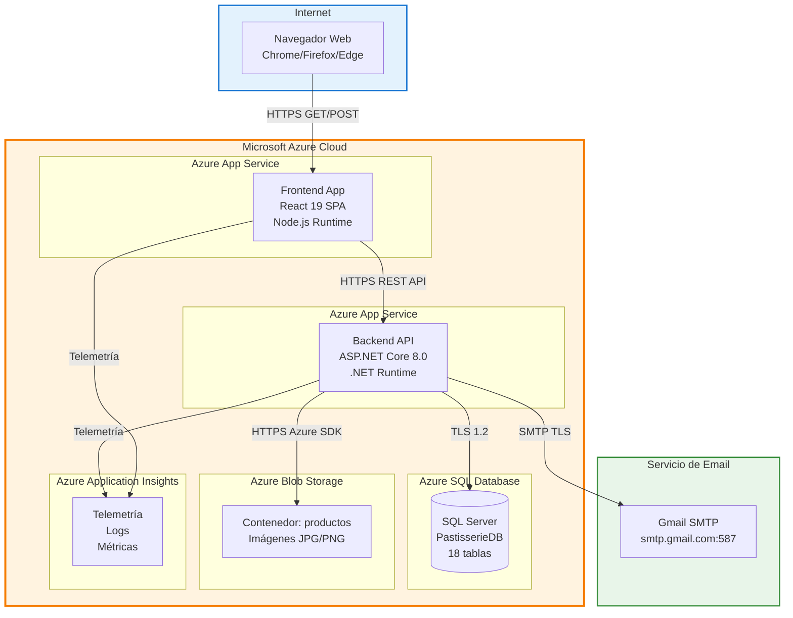
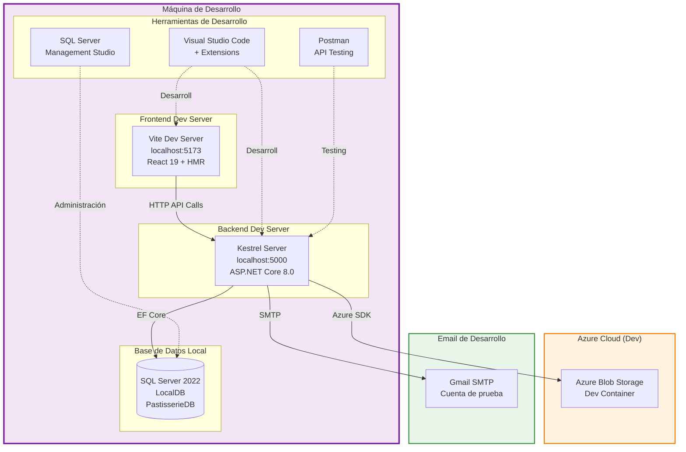

# Diagrama de Despliegue - PASTISSERIE'S DELUXE

Este diagrama representa la arquitectura de despliegue del sistema en entornos de desarrollo y producción.

## Diagrama de Despliegue - Producción



## Diagrama de Despliegue - Desarrollo Local



## Descripción de Componentes de Despliegue

### Entorno de Producción (Azure)

#### 1. Azure App Service - Frontend
**Especificaciones**:
- **Runtime**: Node.js 20 LTS
- **Plan**: Basic B1 (1 Core, 1.75 GB RAM) mínimo
- **Región**: East US / South Central US (más cercano a Colombia)
- **SSL/TLS**: Certificado Let's Encrypt automático

**Configuración**:
- **Build**: `npm run build` (genera carpeta `dist/`)
- **Startup command**: Servidor estático (sirve archivos de `dist/`)
- **Environment variables**:
  - `VITE_API_URL`: URL del backend API
  - `NODE_ENV`: production

**Características**:
- Auto-scaling horizontal (hasta 3 instancias)
- Health checks cada 5 minutos
- Deployment slots para staging/production

#### 2. Azure App Service - Backend API
**Especificaciones**:
- **Runtime**: .NET 8.0
- **Plan**: Standard S1 (1 Core, 1.75 GB RAM) mínimo
- **Región**: Misma que frontend (latencia mínima)
- **SSL/TLS**: Certificado Let's Encrypt automático

**Configuración**:
- **Build**: `dotnet publish -c Release`
- **Startup command**: `dotnet PastisserieAPI.API.dll`
- **Environment variables**:
  - `ConnectionStrings__DefaultConnection`: Connection string a Azure SQL Database
  - `JwtSettings__Secret`: Secreto para firma de JWT
  - `AzureStorage__ConnectionString`: Connection string a Blob Storage
  - `FrontendUrl`: URL del frontend (para CORS + emails)
  - `EmailSettings__Host`: smtp.gmail.com
  - `EmailSettings__Port`: 587
  - `EmailSettings__Username`: Email de la tienda
  - `EmailSettings__Password`: Contraseña de aplicación de Gmail

**Características**:
- Always On activado
- Application Insights integrado
- Deployment via GitHub Actions CI/CD

#### 3. Azure SQL Database
**Especificaciones**:
- **Tier**: Basic (5 DTUs) para desarrollo / Standard S0 (10 DTUs) para producción
- **Storage**: 2 GB (escalable hasta 250 GB)
- **Región**: Misma que App Services
- **Backup**: Automático diario con retención de 7 días

**Configuración**:
- **Autenticación**: SQL Authentication (usuario/contraseña)
- **Firewall**: Permitir servicios de Azure + IP del administrador
- **TLS**: Versión 1.2 obligatoria
- **Connection string**:
  ```
  Server=tcp:{server}.database.windows.net,1433;
  Initial Catalog=PastisserieDB;
  Persist Security Info=False;
  User ID={user};Password={password};
  MultipleActiveResultSets=False;
  Encrypt=True;
  TrustServerCertificate=False;
  Connection Timeout=30;
  ```

**Migración inicial**:
```bash
dotnet ef database update --connection "{connection-string}"
```

#### 4. Azure Blob Storage
**Especificaciones**:
- **Tier**: Standard (General Purpose v2)
- **Replicación**: LRS (Locally Redundant Storage) para desarrollo / GRS (Geo-Redundant) para producción
- **Región**: Misma que App Services

**Configuración**:
- **Contenedor**: `productos` (acceso público de lectura)
- **CORS**: Permitir orígenes del frontend
- **Connection string**:
  ```
  DefaultEndpointsProtocol=https;
  AccountName={account};
  AccountKey={key};
  EndpointSuffix=core.windows.net
  ```

**Estructura**:
```
productos/
├── {guid1}.jpg
├── {guid2}.png
├── {guid3}.jpg
└── ...
```

#### 5. Azure Application Insights
**Especificaciones**:
- **Tier**: Pay-as-you-go (solo pagas por telemetría enviada)
- **Región**: Cualquiera (datos replicados globalmente)

**Características**:
- Logs de aplicación (errores, warnings, info)
- Métricas de performance (tiempo de respuesta, throughput)
- Dependency tracking (llamadas a SQL, Blob Storage)
- Exception tracking automático
- User analytics (páginas más visitadas, flujos de usuarios)

**Integración**:
- Backend: NuGet package `Microsoft.ApplicationInsights.AspNetCore`
- Frontend: NPM package `@microsoft/applicationinsights-web`

#### 6. Gmail SMTP
**Especificaciones**:
- **Host**: smtp.gmail.com
- **Port**: 587 (STARTTLS)
- **Autenticación**: Usuario/contraseña de aplicación

**Uso**:
- Recuperación de contraseña (envío de token)
- Confirmación de email (futuro)
- Notificaciones críticas (futuro)

**Limitaciones**:
- Máximo 500 emails/día con cuenta gratuita
- Alternativa: Azure Communication Services (si se requiere escalabilidad)

### Entorno de Desarrollo Local

#### 1. Vite Dev Server (Frontend)
**Especificaciones**:
- **Puerto**: 5173
- **Hot Module Replacement (HMR)**: Activado
- **Proxy**: Redirige `/api/*` a `http://localhost:5000`

**Comando**:
```bash
cd pastisserie-front
npm run dev
```

**Variables de entorno** (`.env.local`):
```env
VITE_API_URL=http://localhost:5000
```

#### 2. Kestrel Server (Backend)
**Especificaciones**:
- **Puerto**: 5000 (HTTP) / 5001 (HTTPS)
- **CORS**: Permitir `http://localhost:5173`

**Comando**:
```bash
cd PastisserieAPI.API
dotnet run
```

**Configuración** (`appsettings.Development.json`):
```json
{
  "ConnectionStrings": {
    "DefaultConnection": "Server=localhost;Database=PastisserieDB;Trusted_Connection=True;TrustServerCertificate=True;"
  },
  "JwtSettings": {
    "Secret": "dev-secret-key-change-in-production",
    "Issuer": "PastisserieAPI",
    "Audience": "PastisserieClients",
    "ExpirationHours": 24
  },
  "AzureStorage": {
    "ConnectionString": "{dev-storage-connection-string}"
  },
  "FrontendUrl": "http://localhost:5173"
}
```

#### 3. SQL Server LocalDB
**Especificaciones**:
- **Versión**: SQL Server 2022 Express
- **Instancia**: (localdb)\MSSQLLocalDB
- **Base de datos**: PastisserieDB

**Inicialización**:
```bash
# Crear migraciones (si no existen)
dotnet ef migrations add InitialCreate -p ../PastisserieAPI.Infrastructure -s PastisserieAPI.API

# Aplicar migraciones
dotnet ef database update -p ../PastisserieAPI.Infrastructure -s PastisserieAPI.API
```

**Herramientas**:
- **SQL Server Management Studio (SSMS)**: Administración visual
- **Azure Data Studio**: Alternativa multiplataforma

#### 4. Azure Blob Storage (Dev)
**Opción 1: Usar cuenta de Azure real** (recomendado):
- Crear storage account de desarrollo
- Usar mismo código que producción

**Opción 2: Usar Azurite** (emulador local):
- Instalar: `npm install -g azurite`
- Ejecutar: `azurite --silent --location c:\azurite --debug c:\azurite\debug.log`
- Connection string:
  ```
  DefaultEndpointsProtocol=http;
  AccountName=devstoreaccount1;
  AccountKey=Eby8vdM02xNOcqFlqUwJPLlmEtlCDXJ1OUzFT50uSRZ6IFsuFq2UVErCz4I6tq/K1SZFPTOtr/KBHBeksoGMGw==;
  BlobEndpoint=http://127.0.0.1:10000/devstoreaccount1;
  ```

#### 5. Herramientas de Desarrollo

**Visual Studio Code**:
- Extensions:
  - C# Dev Kit
  - ESLint
  - Prettier
  - Tailwind CSS IntelliSense
  - REST Client (para testing de endpoints)

**Postman**:
- Colección de requests para testing de API
- Environment variables (dev vs prod)
- Scripts de pre-request (obtener token automáticamente)

**SQL Server Management Studio**:
- Exploración de tablas
- Ejecución de queries manuales
- Visualización de migraciones aplicadas

## Flujo de Despliegue CI/CD

### GitHub Actions Workflow (Producción)

```yaml
name: Deploy to Azure

on:
  push:
    branches: [ main ]

jobs:
  build-and-deploy-frontend:
    runs-on: ubuntu-latest
    steps:
      - uses: actions/checkout@v3
      - uses: actions/setup-node@v3
        with:
          node-version: '20'
      - run: cd pastisserie-front && npm ci
      - run: cd pastisserie-front && npm run build
      - uses: azure/webapps-deploy@v2
        with:
          app-name: 'pastisserie-deluxe-frontend'
          publish-profile: ${{ secrets.AZURE_WEBAPP_PUBLISH_PROFILE_FRONTEND }}
          package: ./pastisserie-front/dist

  build-and-deploy-backend:
    runs-on: ubuntu-latest
    steps:
      - uses: actions/checkout@v3
      - uses: actions/setup-dotnet@v3
        with:
          dotnet-version: '8.0.x'
      - run: dotnet publish PastisserieAPI.sln -c Release -o ./publish
      - uses: azure/webapps-deploy@v2
        with:
          app-name: 'pastisserie-deluxe-api'
          publish-profile: ${{ secrets.AZURE_WEBAPP_PUBLISH_PROFILE_BACKEND }}
          package: ./publish
```

### Pasos de Despliegue Manual

#### Backend:
1. Compilar en Release:
   ```bash
   dotnet publish -c Release -o ./publish
   ```

2. Comprimir carpeta `publish/` en ZIP

3. Subir ZIP a Azure App Service:
   - Portal Azure → App Service → Deployment Center → ZIP Deploy

4. Aplicar migraciones de base de datos:
   ```bash
   dotnet ef database update --connection "{azure-sql-connection-string}"
   ```

#### Frontend:
1. Compilar para producción:
   ```bash
   cd pastisserie-front
   npm run build
   ```

2. Comprimir carpeta `dist/` en ZIP

3. Subir ZIP a Azure App Service:
   - Portal Azure → App Service → Deployment Center → ZIP Deploy

## Seguridad

### HTTPS/TLS
- **Certificados**: Let's Encrypt automático (renovación cada 90 días)
- **Versión TLS**: 1.2 mínimo
- **HSTS**: Activado (max-age=31536000)

### CORS (Cross-Origin Resource Sharing)
Backend permite requests solo desde:
- `https://pastisserie-deluxe-frontend.azurewebsites.net` (producción)
- `http://localhost:5173` (desarrollo)

### JWT (JSON Web Tokens)
- **Algoritmo**: HS256 (HMAC SHA-256)
- **Expiración**: 24 horas
- **Claims**: UserId, Email, Roles
- **Almacenamiento cliente**: localStorage (considerar httpOnly cookies en futuro)

### Secrets Management
- **Desarrollo**: `appsettings.Development.json` (NO commitear con secrets reales)
- **Producción**: Azure App Service → Configuration → Application settings (encriptadas)

### SQL Injection Prevention
- **Entity Framework Core**: Usa queries parametrizadas (previene SQL injection automáticamente)
- **Validación**: FluentValidation en DTOs

### XSS (Cross-Site Scripting) Prevention
- **React**: Escapa HTML automáticamente en JSX
- **Backend**: No retorna HTML (solo JSON)

## Monitoreo y Logs

### Application Insights
- **Logs de errores**: Excepciones automáticamente reportadas
- **Performance**: Tiempo de respuesta de endpoints
- **Dependencies**: Tiempo de queries SQL, llamadas a Blob Storage
- **Alertas**: Email si tasa de errores > 5% o tiempo de respuesta > 2s

### Azure Monitor
- **Métricas de App Service**:
  - CPU usage
  - Memory usage
  - HTTP requests/second
  - Average response time

### Health Checks
- **Endpoint**: `/health` (retorna 200 OK si DB es accesible)
- **Frecuencia**: Cada 5 minutos
- **Acción**: Restart automático si 3 fallos consecutivos

## Escalabilidad

### Horizontal Scaling (App Services)
- **Frontend**: Auto-scale hasta 3 instancias si CPU > 70%
- **Backend**: Auto-scale hasta 5 instancias si CPU > 70% o memoria > 80%

### Vertical Scaling
- **Fase 1 (0-100 usuarios concurrentes)**: Basic B1
- **Fase 2 (100-500 usuarios)**: Standard S1
- **Fase 3 (500-2000 usuarios)**: Premium P1v2

### Database Scaling
- **Fase 1**: Basic tier (5 DTUs)
- **Fase 2**: Standard S0 (10 DTUs)
- **Fase 3**: Standard S2 (50 DTUs)

### CDN (Content Delivery Network) - Futuro
Para mejorar tiempo de carga de imágenes:
- Azure CDN delante de Blob Storage
- Cache de assets estáticos del frontend

## Costos Estimados (USD/mes)

### Desarrollo
- App Service (Basic B1) × 2: $25 × 2 = **$50**
- Azure SQL Database (Basic): **$5**
- Blob Storage (100 GB): **$2**
- Application Insights (5 GB telemetría): **$0** (free tier)
- **Total**: **~$57/mes**

### Producción (hasta 500 usuarios concurrentes)
- App Service (Standard S1) × 2: $70 × 2 = **$140**
- Azure SQL Database (Standard S0): **$15**
- Blob Storage (500 GB): **$10**
- Application Insights (25 GB telemetría): **$5**
- **Total**: **~$170/mes**

## Requisitos de Infraestructura

### Mínimos (Desarrollo)
- **Frontend**: 1 Core, 1 GB RAM
- **Backend**: 1 Core, 1.75 GB RAM
- **Database**: 5 DTUs
- **Storage**: 100 GB

### Recomendados (Producción)
- **Frontend**: 2 Cores, 3.5 GB RAM (Standard S1)
- **Backend**: 2 Cores, 3.5 GB RAM (Standard S1)
- **Database**: 10 DTUs (Standard S0)
- **Storage**: 500 GB + CDN

## Generado
- **Fecha**: 03/04/2026
- **Versión**: 1.0
- **Estado**: Refleja arquitectura de despliegue actual y recomendaciones
