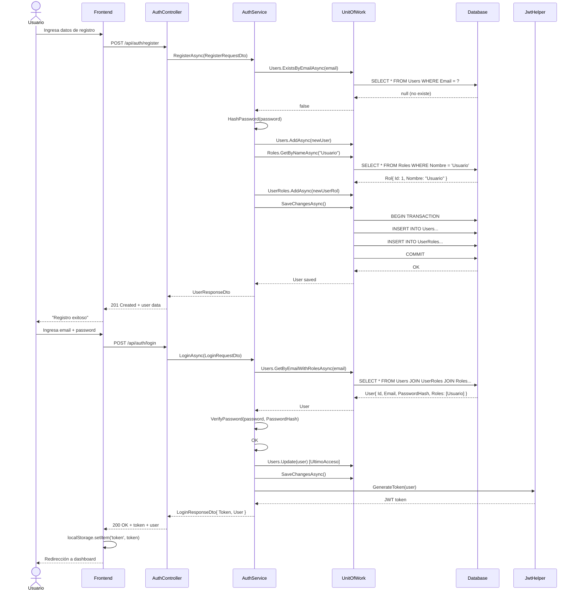
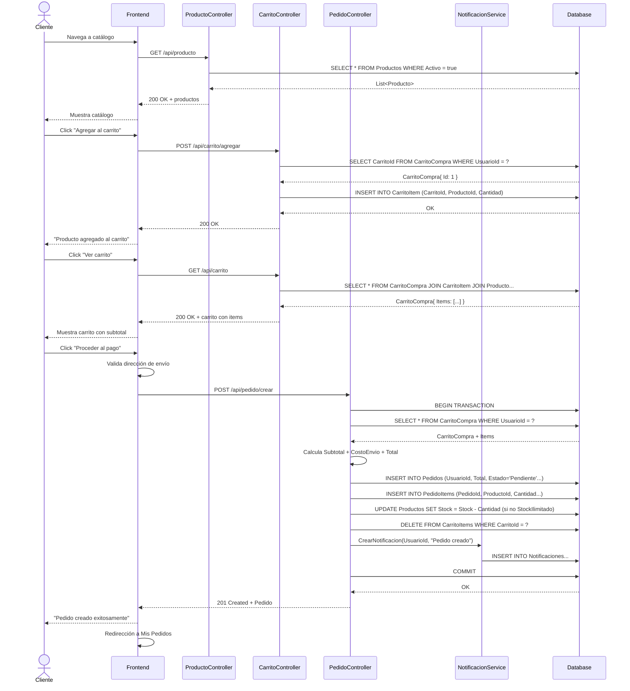
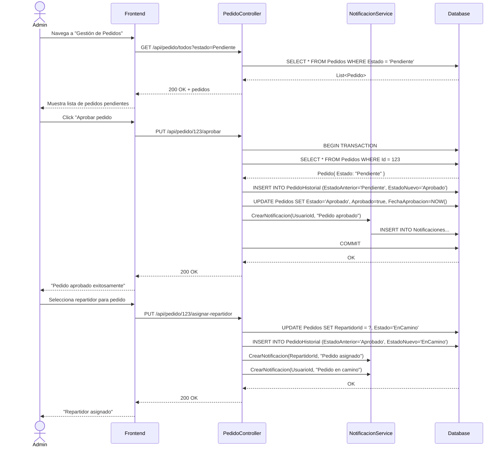
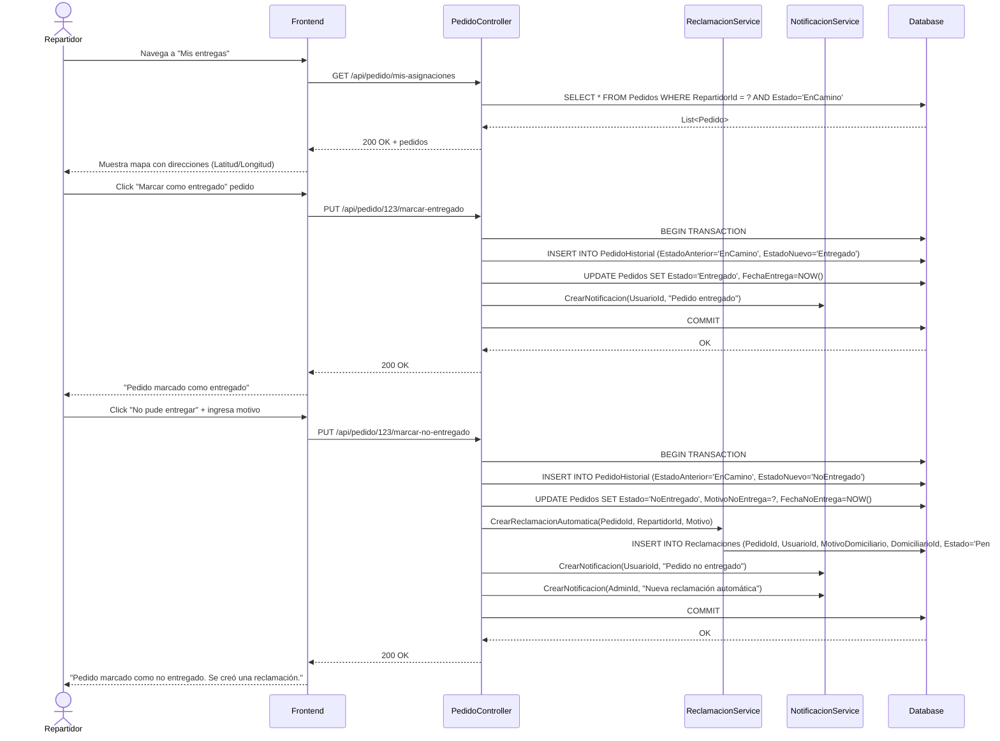
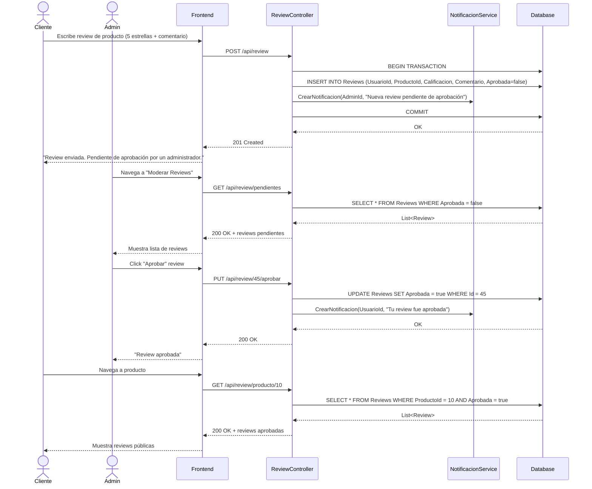
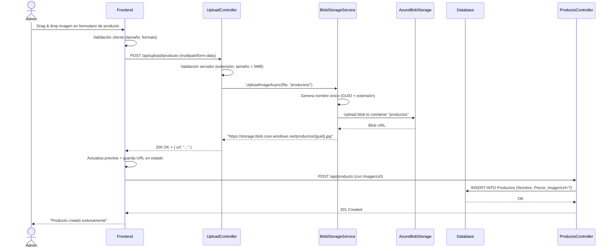
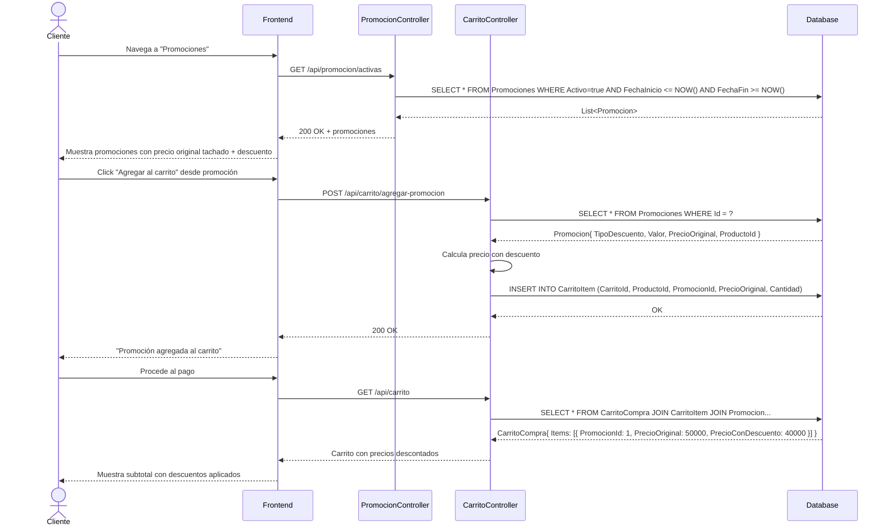

# Diagramas de Secuencia - PASTISSERIE'S DELUXE

Este documento contiene los diagramas de secuencia de los flujos principales del sistema.

## 1. Flujo de Registro e Inicio de Sesión

## 2. Flujo de Compra Completo (Cliente)

## 3. Flujo de Gestión de Pedido (Admin)

## 4. Flujo de Entrega (Repartidor)

## 5. Flujo de Review con Moderación

## 6. Flujo de Subida de Imagen a Azure Blob Storage

## 7. Flujo de Aplicación de Promoción

## Notas Técnicas

### Transacciones de Base de Datos
- **BEGIN TRANSACTION** → operaciones críticas → **COMMIT** / **ROLLBACK**
- Usadas en: creación de pedidos, aprobación, cambios de estado, updates de stock

### Autenticación JWT
- Token generado en login, incluye roles del usuario
- Frontend incluye token en header: `Authorization: Bearer {token}`
- Middleware de autenticación valida en cada request a endpoints protegidos

### Validaciones
- **Cliente**: Validación básica de formularios (tamaño archivo, formato email)
- **Servidor**: FluentValidation en DTOs, validaciones de negocio en Services
- **Base de datos**: Constraints (UNIQUE email, FOREIGN KEY, CHECK)

### Notificaciones Automáticas
Eventos que disparan notificaciones:
- Pedido creado → Cliente
- Pedido aprobado → Cliente
- Pedido en camino → Cliente
- Repartidor asignado → Repartidor
- Pedido entregado → Cliente
- Pedido no entregado → Cliente + Admin (vía Reclamación)
- Review aprobada → Cliente
- Nueva review → Admin

### Cálculo de Costos
1. **Subtotal**: Suma de (PrecioUnitario × Cantidad) de cada item
2. **Costo de envío**: Según comuna (desde ConfiguracionTienda.CostosEnvioPorComuna) o valor default
3. **Total**: Subtotal + CostoEnvio

### Estados de Pedido
Pendiente → Aprobado → EnCamino → Entregado / NoEntregado / Cancelado

Cada cambio registra:
- Entrada en `PedidoHistorial`
- Notificación al usuario
- Actualización de `Pedido.FechaActualizacion`

## Generado
- **Fecha**: 03/04/2026
- **Versión**: 1.0
- **Estado**: Refleja flujos actuales al 03/04/2026
