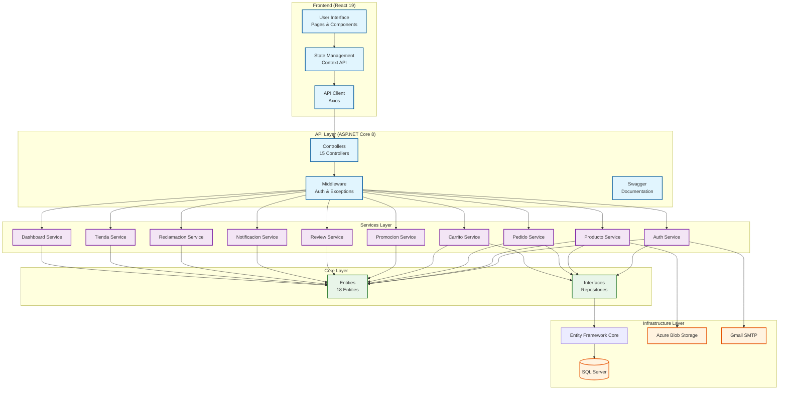

# Arquitectura de Software - PastisserieDeluxe

**Proyecto**: PASTISSERIE'S DELUXE  
**Código**: SENA Ficha 3035528  
**Versión**: 2.0  
**Fecha**: 03/04/2026  
**Estado**: 85-90% FUNCIONAL

---

## 1. Visión General de la Arquitectura

### 1.1 Estilo Arquitectónico

El sistema **PastisserieDeluxe** implementa una **Arquitectura Limpia (Clean Architecture)** dividida en capas bien definidas, siguiendo los principios de inversión de dependencias y separación de responsabilidades.

```
┌─────────────────────────────────────────────────────────────────────────┐
│                         PRESENTATION LAYER                              │
│                    (Frontend - React 19 + TypeScript)                  │
│   Pages │ Components │ Contexts │ Hooks │ Services                      │
└─────────────────────────────────────────────────────────────────────────┘
                                    │
                                    ▼
┌─────────────────────────────────────────────────────────────────────────┐
│                           API LAYER                                    │
│                  (ASP.NET Core 8.0 - Controllers)                      │
│   AuthController │ ProductosController │ PedidosController │ etc.      │
└─────────────────────────────────────────────────────────────────────────┘
                                    │
                                    ▼
┌─────────────────────────────────────────────────────────────────────────┐
│                        SERVICES LAYER                                   │
│              (Business Logic - DTOs - Validators)                      │
│   AuthService │ ProductoService │ PedidoService │ etc.                  │
│   FluentValidation │ AutoMapper │                                      │
└─────────────────────────────────────────────────────────────────────────┘
                                    │
                                    ▼
┌─────────────────────────────────────────────────────────────────────────┐
│                      INFRASTRUCTURE LAYER                               │
│              (Data Access - Repositories - EF Core)                    │
│   ApplicationDbContext │ Repositories │ Migrations │                   │
│   Azure Blob Storage │ SMTP Email                                       │
└─────────────────────────────────────────────────────────────────────────┘
                                    │
                                    ▼
┌─────────────────────────────────────────────────────────────────────────┐
│                         CORE LAYER                                      │
│              (Entities - Enums - Interfaces - Base)                   │
│   User │ Producto │ Pedido │ Categoria │ Review │ etc.                  │
└─────────────────────────────────────────────────────────────────────────┘
```

### 1.2 Principios Aplicados

| Principio | Implementación |
|-----------|----------------|
| **Separation of Concerns** | Cada capa tiene responsabilidad única |
| **Single Responsibility** | Cada clase tiene una tarea específica |
| **Dependency Inversion** | Capas dependen de abstracciones, no de implementaciones |
| **DRY (Don't Repeat Yourself)** | Lógica reutilizable en servicios |
| **SOLID** | Aplicado en el diseño de servicios e interfaces |

---

## 2. Arquitectura de Capas

### 2.1 Core Layer (Núcleo)

**Ubicación**: `PastisserieAPI.Core/`

```
Core/
├── Entities/
│   ├── User.cs
│   ├── Producto.cs
│   ├── Pedido.cs
│   ├── CategoriaProducto.cs
│   ├── Review.cs
│   ├── Promocion.cs
│   ├── CarritoCompra.cs
│   ├── CarritoItem.cs
│   ├── DireccionEnvio.cs
│   ├── PedidoItem.cs
│   ├── PedidoHistorial.cs
│   ├── RegistroPago.cs
│   ├── Notificacion.cs
│   ├── ConfiguracionTienda.cs
│   ├── HorarioDia.cs
│   ├── Reclamacion.cs
│   ├── Rol.cs
│   └── UserRol.cs
├── Enums/
│   └── (Enumeraciones del sistema)
├── Interfaces/
│   ├── IRepository.cs
│   ├── IUnitOfWork.cs
│   └── (Interfaces de servicios)
└── Base/
    └── (Clases base heredadas)
```

**Responsabilidades**:
- Definir entidades del dominio
- Definir interfaces de repositorios
- No conocer detalles de implementación (persistencia, UI)

### 2.2 Infrastructure Layer (Infraestructura)

**Ubicación**: `PastisserieAPI.Infrastructure/`

```
Infrastructure/
├── Data/
│   ├── ApplicationDbContext.cs
│   ├── ApplicationDbContextFactory.cs
│   └── (Configuraciones de EF)
├── Repositories/
│   ├── Repository.cs
│   └── (Implementaciones de repositorios)
├── Migrations/
│   └── (33 migraciones EF Core)
└── Configurations/
    └── (Fluent API configurations)
```

**Responsabilidades**:
- Implementar acceso a datos con Entity Framework Core
- Gestionar migraciones de base de datos
- Configurar relaciones y restricciones
- Integración con Azure Blob Storage
- Integración con SMTP Gmail

### 2.3 Services Layer (Servicios)

**Ubicación**: `PastisserieAPI.Services/`

```
Services/
├── Services/
│   ├── AuthService.cs
│   ├── ProductoService.cs
│   ├── CarritoService.cs
│   ├── PedidoService.cs
│   ├── PagosService.cs
│   ├── PromocionService.cs
│   ├── ReviewService.cs
│   ├── NotificacionService.cs
│   ├── ReclamacionService.cs
│   ├── TiendaService.cs
│   ├── DashboardService.cs
│   └── EmailService.cs
├── DTOs/
│   ├── Request/
│   │   ├── RegisterRequestDto.cs
│   │   ├── CreateProductoRequestDto.cs
│   │   ├── CreatePedidoRequestDto.cs
│   │   └── (Otros DTOs de request)
│   └── Response/
│       ├── LoginResponseDto.cs
│       ├── ProductoResponseDto.cs
│       ├── PedidoResponseDto.cs
│       └── (Otros DTOs de response)
├── Validators/
│   └── (FluentValidation validators)
└── Mapping/
    └── MappingProfile.cs
```

**Responsabilidades**:
- Implementar lógica de negocio
- Transformar entidades a DTOs y viceversa
- Validar datos con FluentValidation
- Coordinar operaciones entre repositorios
- Generar notificaciones

### 2.4 API Layer (Controladores)

**Ubicación**: `PastisserieAPI.API/`

```
API/
├── Controllers/
│   ├── AuthController.cs
│   ├── ProductosController.cs
│   ├── CategoriasController.cs
│   ├── CarritoController.cs
│   ├── PedidosController.cs
│   ├── PagosController.cs
│   ├── PromocionesController.cs
│   ├── ReviewsController.cs
│   ├── NotificacionesController.cs
│   ├── ReclamacionesController.cs
│   ├── TiendaController.cs
│   ├── DashboardController.cs
│   ├── UsersController.cs
│   └── UploadController.cs
├── Middleware/
│   ├── (GlobalExceptionMiddleware.cs)
│   └── (Otros middlewares)
├── Program.cs
├── appsettings.json
└── (Configuración adicional)
```

**Responsabilidades**:
- Exponer endpoints RESTful
- Validar autenticación y autorización
- Manejar errores y retornar respuestas estandarizadas
- Documentar API (Swagger/OpenAPI)

### 2.5 Presentation Layer (Frontend)

**Ubicación**: `pastisserie-front/`

```
src/
├── api/
│   ├── apiClient.ts
│   └── (Servicios de llamada al backend)
├── components/
│   ├── common/
│   │   ├── Navbar.tsx
│   │   ├── Footer.tsx
│   │   ├── ProductCard.tsx
│   │   ├── CartSidebar.tsx
│   │   └── (Componentes compartidos)
│   └── admin/
│       └── (Componentes específicos de admin)
├── context/
│   ├── AuthContext.tsx
│   └── CartContext.tsx
├── hooks/
│   ├── useAuth.ts
│   ├── useTiendaStatus.ts
│   └── (Hooks personalizados)
├── pages/
│   ├── home.tsx
│   ├── catalogo.tsx
│   ├── productDetail.tsx
│   ├── carrito.tsx
│   ├── checkout.tsx
│   ├── login.tsx
│   ├── register.tsx
│   ├── perfil.tsx
│   ├── admin/
│   │   ├── Dashboard.tsx
│   │   ├── productosAdmin.tsx
│   │   ├── pedidosAdmin.tsx
│   │   └── (Páginas de admin)
│   └── repartidor/
│       └── (Páginas de repartidor)
├── types/
│   └── (Definiciones de TypeScript)
└── utils/
    └── (Funciones utilitarias)
```

**Responsabilidades**:
- Renderizar interfaz de usuario
- Gestionar estado con React Context
- Consumir API REST
- Manejar rutas con React Router
- Aplicar estilos con Tailwind CSS

---

## 3. Tecnologías y Servicios

### 3.1 Backend

| Tecnología | Propósito | Versión |
|------------|-----------|---------|
| ASP.NET Core | Framework web | 8.0 |
| Entity Framework Core | ORM | 8.0.x |
| SQL Server | Base de datos | 2022 |
| JWT | Autenticación | Bearer |
| FluentValidation | Validación de DTOs | - |
| AutoMapper | Mapeo objetos | - |
| BCrypt | Hash de contraseñas | - |
| Swagger/OpenAPI | Documentación | - |

### 3.2 Frontend

| Tecnología | Propósito | Versión |
|------------|-----------|---------|
| React | Framework UI | 19.x |
| TypeScript | Tipado estático | 5.x |
| Vite | Bundler | 6.x |
| Tailwind CSS | Estilos | v4 |
| React Router | Enrutamiento | 7.x |
| React Context | Estado global | - |
| Axios | HTTP Client | - |

### 3.3 Servicios Externos

| Servicio | Propósito |
|----------|-----------|
| Azure App Service | Hosting frontend (Static Web Apps) |
| Azure SQL | Base de datos gestionada |
| Azure Blob Storage | Almacenamiento de imágenes |
| Gmail SMTP | Envío de emails (recuperación contraseña) |

---

## 4. Flujo de Datos

### 4.1 Flujo de una Solicitud Típica

```
Usuario hace clic en "Agregar al Carrito"
        │
        ▼
Frontend: ProductCard.tsx llama a apiClient.post()
        │
        ▼
HTTP POST /api/carrito/agregar
        │
        ▼
API Layer: CarritoController.PostAgregar()
        │ Valida [Authorize]
        │ Valida ModelState
        ▼
Services Layer: CarritoService.AddItemAsync()
        │ Valida stock
        │ Obtiene/crea CarritoCompra
        │ Inserta CarritoItem
        ▼
Infrastructure: CarritoRepository.Add()
        │
        ▼
Database: INSERT CarritoItems
        │
        ▼
Response: 200 OK con CarritoResponseDto
        │
        ▼
Frontend: CartContext actualiza estado
        │ Actualiza badge
        │ Muestra toast
        ▼
UI Actualizado
```

### 4.2 Flujo de Autenticación

```
1. Usuario envía credenciales
   POST /api/auth/login { email, password }
        │
2. AuthController recibe request
   │
3. AuthService valida credenciales
   │ Busca usuario por email
   │ Compara password con BCrypt
   │
4. Generate JWT Token
   │ Crea ClaimsIdentity
   │ Genera token con JwtHelper
   │ Configura: Issuer, Audience, Expiration
   │
5. Retorna LoginResponseDto
   { token, user: { id, nombre, email, rol } }
        │
6. Frontend guarda token en localStorage
   │ AuthContext.setToken()
   │ AuthContext.setUser()
   │
7. Subsequent requests incluyen header
   Authorization: Bearer {token}
```

---

## 5. Patrones de Diseño Aplicados

### 5.1 Repository Pattern

```csharp
public interface IRepository<T> where T : class
{
    Task<T> GetByIdAsync(int id);
    Task<IEnumerable<T>> GetAllAsync();
    Task<T> AddAsync(T entity);
    Task UpdateAsync(T entity);
    Task DeleteAsync(int id);
}

public class Repository<T> : IRepository<T> where T : class
{
    private readonly ApplicationDbContext _context;
    private readonly DbSet<T> _dbSet;

    public Repository(ApplicationDbContext context)
    {
        _context = context;
        _dbSet = context.Set<T>();
    }
    // Implementación de métodos...
}
```

### 5.2 Unit of Work

```csharp
public interface IUnitOfWork
{
    IRepository<User> Users { get; }
    IRepository<Producto> Productos { get; }
    Task SaveChangesAsync();
}

public class UnitOfWork : IUnitOfWork
{
    private readonly ApplicationDbContext _context;

    public UnitOfWork(ApplicationDbContext context)
    {
        _context = context;
    }

    private IRepository<User> _users;
    public IRepository<User> Users => _users ??= new Repository<User>(_context);

    // Otros repositorios...

    public async Task SaveChangesAsync()
    {
        await _context.SaveChangesAsync();
    }
}
```

### 5.3 DTO Pattern

```csharp
// Request DTOs
public class CreateProductoRequestDto
{
    [Required]
    [MaxLength(200)]
    public string Nombre { get; set; }

    [MaxLength(1000)]
    public string Descripcion { get; set; }

    [Required]
    public decimal Precio { get; set; }

    public int Stock { get; set; }

    public bool StockIlimitado { get; set; }

    public int? CategoriaProductoId { get; set; }
}

// Response DTOs
public class ProductoResponseDto
{
    public int Id { get; set; }
    public string Nombre { get; set; }
    public string Descripcion { get; set; }
    public decimal Precio { get; set; }
    public int Stock { get; set; }
    public bool StockIlimitado { get; set; }
    public string ImagenUrl { get; set; }
    public bool Activo { get; set; }
    public string CategoriaNombre { get; set; }
}
```

### 5.4 API Response Pattern

```csharp
public class ApiResponse<T>
{
    public bool Success { get; set; }
    public string Message { get; set; }
    public T Data { get; set; }
    public List<string> Errors { get; set; }

    public static ApiResponse<T> SuccessResponse(T data, string message = "Operación exitosa")
    {
        return new ApiResponse<T>
        {
            Success = true,
            Message = message,
            Data = data
        };
    }

    public static ApiResponse<T> ErrorResponse(string message, List<string> errors = null)
    {
        return new ApiResponse<T>
        {
            Success = false,
            Message = message,
            Errors = errors
        };
    }
}
```

---

## 6. Seguridad

### 6.1 Autenticación JWT

- **Algoritmo**: HMAC SHA256
- **Expiración**: 24 horas (1440 minutos)
- **Claims**: UserId, Email, Rol
- **Configuración**: appsettings.json > JwtSettings

### 6.2 Autorización por Roles

```csharp
// Solo Admin
[Authorize(Roles = "Admin")]
[HttpGet]
public IActionResult GetAll() { ... }

// Usuario autenticado
[Authorize]
[HttpGet]
public IActionResult GetMisPedidos() { ... }

// Repartidor
[Authorize(Roles = "Repartidor")]
[HttpGet]
public IActionResult GetPedidosAsignados() { ... }
```

### 6.3 Validaciones

- **FluentValidation**: Todos los DTOs de request
- **DataAnnotations**: Entidades del modelo
- **Contraseñas**: Hash BCrypt con cost factor 11

---

## 7. Despliegue

### 7.1 Arquitectura de Despliegue

```
┌─────────────────────────────────────────────────────────────────────────┐
│                         AZURE CLOUD                                     │
├─────────────────────────────────────────────────────────────────────────┤
│                                                                         │
│  ┌─────────────────┐      ┌─────────────────┐      ┌─────────────────┐ │
│  │  Static Web    │      │   Azure SQL    │      │  Azure Blob    │ │
│  │  Apps          │─────▶│   Database     │      │  Storage       │ │
│  │  (Frontend)    │      │  (SQL Server)  │      │  (Imágenes)    │ │
│  │                │      │                 │      │                 │ │
│  └─────────────────┘      └─────────────────┘      └─────────────────┘ │
│         │                        │                        │            │
│         │                        │                        │            │
│  ┌──────┴──────┐          ┌──────┴──────┐                │            │
│  │   Custom    │          │   Entity    │                │            │
│  │   Domain    │          │   Framework │                │            │
│  │  (SSL/TLS)  │          │   Core      │                │            │
│  └─────────────┘          └─────────────┘                │            │
│                                                         │            │
│  URL: https://pastisseriedeluxe.azurewebsites.net       │            │
└─────────────────────────────────────────────────────────┴────────────┘
```

### 7.2 Configuración de Producción

| Componente | Configuración |
|-------------|---------------|
| Frontend | Azure Static Web Apps |
| Backend API | Azure App Service (Web API) |
| Database | Azure SQL (Standard Tier) |
| Storage | Azure Blob Storage (Standard) |
| SSL | Azure-provided (自带) |

---

## 8. Diagrama de Componentes



---

## 9. Conclusión

La arquitectura de PastisserieDeluxe está diseñada para ser:

- **Maintainable**: Separación clara de responsabilidades
- **Testable**: Dependencias inyectables, lógica de negocio aislada
- **Scalable**: Capas independientes que pueden evolucionar
- **Secure**: Autenticación JWT, validación de DTOs, protección por roles

El sistema está **85-90% funcional** con 18 entidades activas, 33 migraciones de base de datos, y despligue completo en Azure.

---

*Documento generado el 03/04/2026 como parte del proyecto PastisserieDeluxe - SENA Ficha 3035528*