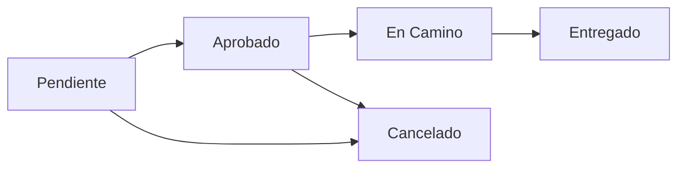

# Manual de Usuario - PASTISSERIE'S DELUXE

**Versión**: 1.0  
**Fecha**: 03/04/2026  
**Proyecto**: Sistema de E-Commerce para Pastelería  
**SENA Ficha**: 3035528  

---

## Tabla de Contenidos

1. [Introducción](#introducción)
2. [Acceso al Sistema](#acceso-al-sistema)
3. [Módulo Cliente](#módulo-cliente)
4. [Módulo Administrador](#módulo-administrador)
5. [Módulo Repartidor](#módulo-repartidor)
6. [Preguntas Frecuentes](#preguntas-frecuentes)
7. [Solución de Problemas](#solución-de-problemas)
8. [Glosario](#glosario)

---

## 1. Introducción

### 1.1 Propósito del Manual

Este manual proporciona instrucciones detalladas para utilizar el sistema **PASTISSERIE'S DELUXE**, una plataforma de e-commerce diseñada para la compra de productos de pastelería. El manual está dirigido a tres tipos de usuarios:

- **Clientes**: Personas que desean comprar productos de pastelería
- **Administradores**: Personal encargado de gestionar productos, pedidos y configuración
- **Repartidores**: Personal de entrega que gestiona el transporte de pedidos

### 1.2 Alcance del Sistema

**PASTISSERIE'S DELUXE** permite:

- **A los clientes**: Navegar catálogo, comprar productos, seguir pedidos, escribir reseñas
- **A los administradores**: Gestionar inventario, procesar pedidos, moderar contenido, generar reportes
- **A los repartidores**: Recibir asignaciones de entrega, actualizar estados, usar GPS para navegación

### 1.3 Requisitos Mínimos

Para utilizar el sistema necesitas:

- **Navegador web moderno**: Google Chrome 100+, Firefox 95+, Edge 100+, Safari 15+
- **Conexión a internet**: Mínimo 2 Mbps para navegación fluida
- **Dispositivos compatibles**: PC, laptop, tablet, smartphone
- **Resolución de pantalla**: Mínimo 360px de ancho (diseño responsive)

### 1.4 Convenciones del Manual

A lo largo del manual utilizaremos estos símbolos:

- ✅ **Acción exitosa**: Indica que la operación se completó correctamente
- ⚠️ **Advertencia**: Información importante que debes tener en cuenta
- ❌ **Error**: Situación que puede causar problemas
- 💡 **Consejo**: Recomendación o buena práctica
- 📝 **Nota**: Información adicional relevante

---

## 2. Acceso al Sistema

### 2.1 Registro de Nueva Cuenta

Si eres un nuevo usuario (cliente), sigue estos pasos:

#### Paso 1: Acceder a la Página de Registro

1. Abre tu navegador web
2. Ingresa la URL del sistema: `http://localhost:5173` (desarrollo) o la URL de producción
3. En la página principal, haz clic en el botón **"Registrarse"** ubicado en la esquina superior derecha

#### Paso 2: Completar el Formulario de Registro

El formulario solicita la siguiente información:

| Campo | Descripción | Ejemplo |
|-------|-------------|---------|
| **Nombre Completo** | Tu nombre y apellidos | Juan Pérez García |
| **Email** | Correo electrónico válido (se usará para login) | juan.perez@ejemplo.com |
| **Teléfono** | Número de contacto con código de país | +57 300 123 4567 |
| **Contraseña** | Mínimo 6 caracteres | ••••••••• |
| **Confirmar Contraseña** | Debe coincidir con la contraseña | ••••••••• |

#### Paso 3: Validación y Confirmación

1. Completa todos los campos obligatorios (marcados con asterisco)
2. Asegúrate de que las contraseñas coincidan
3. Haz clic en el botón **"Registrarse"**
4. El sistema validará la información:
   - ✅ Si todo es correcto: Recibirás un mensaje de éxito y serás redirigido al login
   - ❌ Si hay errores: Se mostrarán mensajes en rojo indicando qué corregir

**Errores comunes:**
- "El email ya está registrado" → Utiliza otro email o inicia sesión
- "Las contraseñas no coinciden" → Verifica que ambas contraseñas sean idénticas
- "Formato de email inválido" → Asegúrate de usar el formato nombre@dominio.com

💡 **Consejo**: Usa una contraseña fuerte que combine letras, números y símbolos.

📝 **Nota**: Los usuarios se registran automáticamente con el rol **"Usuario"** (Cliente). Para obtener roles de Administrador o Repartidor, contacta al administrador del sistema.

---

### 2.2 Inicio de Sesión

#### Paso 1: Acceder al Login

1. En la página principal, haz clic en **"Iniciar Sesión"**
2. Se mostrará el formulario de login

#### Paso 2: Ingresar Credenciales

1. Ingresa tu **email** registrado
2. Ingresa tu **contraseña**
3. Haz clic en **"Iniciar Sesión"**

#### Paso 3: Confirmación

- ✅ **Login exitoso**: Serás redirigido a la página principal con tu sesión activa
  - Verás tu nombre en la barra de navegación
  - El botón "Iniciar Sesión" cambiará a "Cerrar Sesión"
- ❌ **Login fallido**: Verás el mensaje "Credenciales inválidas"

**Errores comunes:**
- "Credenciales inválidas" → Verifica email y contraseña
- "Usuario no encontrado" → Regístrate primero o verifica el email
- "Cuenta bloqueada" → Contacta al administrador

💡 **Consejo**: Si no recuerdas tu contraseña, usa la opción "¿Olvidaste tu contraseña?"

---

### 2.3 Recuperación de Contraseña

Si olvidaste tu contraseña:

#### Paso 1: Solicitar Recuperación

1. En la página de login, haz clic en **"¿Olvidaste tu contraseña?"**
2. Ingresa tu **email registrado**
3. Haz clic en **"Enviar enlace de recuperación"**

#### Paso 2: Revisar tu Email

1. Abre tu correo electrónico
2. Busca un email de **PASTISSERIE'S DELUXE** con asunto "Recuperación de contraseña"
3. Haz clic en el enlace incluido en el email

⚠️ **Advertencia**: El enlace de recuperación expira después de **1 hora**. Si no lo usas a tiempo, deberás solicitar uno nuevo.

#### Paso 3: Establecer Nueva Contraseña

1. Serás redirigido a una página para restablecer la contraseña
2. Ingresa tu **nueva contraseña** (mínimo 6 caracteres)
3. Confirma la nueva contraseña
4. Haz clic en **"Restablecer contraseña"**
5. ✅ Recibirás un mensaje de confirmación y podrás iniciar sesión con la nueva contraseña

📝 **Nota**: Si no recibes el email de recuperación:
- Revisa tu carpeta de spam/correo no deseado
- Verifica que el email ingresado sea el correcto
- Espera unos minutos (el envío puede tardar hasta 5 minutos)

---

### 2.4 Cerrar Sesión

Para salir del sistema de forma segura:

1. Haz clic en tu **nombre de usuario** en la esquina superior derecha
2. Selecciona **"Cerrar Sesión"**
3. Confirma la acción
4. ✅ Serás redirigido a la página principal como usuario no autenticado

💡 **Consejo**: Siempre cierra sesión si usas un dispositivo compartido o público.

---

## 3. Módulo Cliente

### 3.1 Navegación del Catálogo

#### 3.1.1 Explorar Productos

La página de **Catálogo** muestra todos los productos disponibles:

**Acceso**: Menú principal → **"Catálogo"**

**Elementos de la vista:**
- **Tarjetas de producto**: Cada producto se muestra con:
  - Imagen del producto
  - Nombre
  - Precio (COP)
  - Botón "Ver Detalles"
  - Botón "Añadir al Carrito"
  - Etiqueta de promoción (si aplica)

**Funcionalidades disponibles:**

1. **Búsqueda por nombre**:
   - Escribe en el campo de búsqueda ubicado en la parte superior
   - La búsqueda es **en tiempo real** (no necesitas presionar Enter)
   - Busca por nombre o descripción del producto

2. **Filtrado por categoría**:
   - Usa el selector de categorías para ver solo productos específicos
   - Categorías ejemplo: Tortas, Postres, Galletas, Panes, etc.
   - Selecciona "Todas" para ver el catálogo completo

3. **Ordenamiento**:
   - Ordena por: Precio (menor a mayor), Precio (mayor a menor), Nombre (A-Z)

4. **Paginación**:
   - El catálogo muestra **12 productos por página**
   - Usa los botones "Anterior" / "Siguiente" para navegar

💡 **Consejo**: Combina búsqueda + filtros para encontrar productos rápidamente.

---

#### 3.1.2 Ver Detalles de Producto

Para ver información completa de un producto:

**Paso 1: Acceder al Detalle**
1. En el catálogo, haz clic en **"Ver Detalles"** de cualquier producto
2. Serás redirigido a la página de detalles

**Información mostrada:**
- **Galería de imágenes**: Vista principal + miniaturas (si hay múltiples imágenes)
- **Nombre del producto**
- **Precio**: Precio actual y precio original si hay descuento
- **Categoría**
- **Descripción detallada**: Ingredientes, tamaño, peso, etc.
- **Estado de stock**:
  - ✅ "Disponible" (stock > 0 o stock ilimitado)
  - ❌ "Agotado" (stock = 0)
- **Selector de cantidad**: Usa los botones +/- para ajustar cantidad
- **Botón "Añadir al Carrito"**: Para agregar el producto con la cantidad seleccionada

**Sección de Reseñas:**
- **Calificación promedio**: Estrellas (1-5) y número de reseñas
- **Lista de reseñas**: Muestra las reseñas aprobadas por el administrador
  - Nombre del usuario
  - Calificación (estrellas)
  - Comentario
  - Fecha de publicación

**Escribir una reseña:**
1. Debes estar **autenticado** y haber **comprado el producto**
2. En la sección de reseñas, haz clic en **"Escribir reseña"**
3. Selecciona tu **calificación** (1-5 estrellas)
4. Escribe tu **comentario** (mínimo 10 caracteres, máximo 500)
5. Haz clic en **"Enviar reseña"**
6. ✅ Recibirás confirmación: "Reseña enviada. Será visible después de ser aprobada por el administrador"

⚠️ **Advertencia**: Solo puedes escribir **una reseña por producto**. Las reseñas deben ser aprobadas antes de aparecer públicamente.

---

### 3.2 Carrito de Compras

#### 3.2.1 Añadir Productos al Carrito

Hay dos formas de añadir productos:

**Opción 1: Desde el Catálogo**
1. En la tarjeta de producto, haz clic en **"Añadir al Carrito"**
2. El producto se añade con **cantidad = 1**
3. Verás una notificación de confirmación

**Opción 2: Desde Detalles del Producto**
1. Ajusta la **cantidad** con los botones +/-
2. Haz clic en **"Añadir al Carrito"**
3. El producto se añade con la cantidad seleccionada

📝 **Nota**: Debes estar **autenticado** para añadir productos al carrito. Si no lo estás, serás redirigido al login.

💡 **Consejo**: El carrito es **persistente** — tus productos se guardan en la base de datos y estarán disponibles aunque cierres el navegador.

---

#### 3.2.2 Ver y Gestionar el Carrito

**Acceso**: Menú principal → Icono del carrito (🛒) → **"Ver Carrito"**

**Información mostrada:**
- **Lista de productos**: Cada ítem muestra:
  - Imagen del producto
  - Nombre
  - Precio unitario
  - Cantidad (editable)
  - Subtotal (precio × cantidad)
  - Botón "Eliminar"

- **Resumen del pedido**:
  - Subtotal (suma de todos los productos)
  - IVA (calculado automáticamente)
  - **Total a pagar**

**Acciones disponibles:**

1. **Modificar cantidad**:
   - Usa los botones +/- en cada ítem
   - El subtotal y total se recalculan automáticamente
   - ⚠️ No puedes exceder el stock disponible (verás mensaje de error)

2. **Eliminar producto**:
   - Haz clic en el botón **"Eliminar"** (🗑️)
   - Confirma la acción
   - El producto se eliminará del carrito

3. **Vaciar carrito completo**:
   - Haz clic en **"Vaciar Carrito"**
   - Confirma la acción
   - Todos los productos serán eliminados

4. **Proceder al Checkout**:
   - Haz clic en **"Proceder al Pago"**
   - Serás redirigido a la página de checkout

📝 **Nota**: El carrito muestra el **indicador de cantidad** en el icono del menú (ej: 🛒 3).

---

#### 3.2.3 Proceso de Checkout

El checkout es un proceso de **3 pasos**:

**PASO 1: Dirección de Envío**

1. **Si ya tienes direcciones guardadas**:
   - Selecciona una dirección de la lista
   - O haz clic en **"Agregar nueva dirección"**

2. **Para agregar nueva dirección**:
   - Completa el formulario:
     - **Departamento**: Selecciona de la lista
     - **Ciudad**: Selecciona según el departamento
     - **Dirección completa**: Calle, número, barrio (ej: "Calle 123 #45-67, Barrio Centro")
     - **Detalles adicionales** (opcional): Referencias, apartamento, instrucciones de entrega
     - **Coordenadas GPS** (opcional): Latitud y Longitud (si conoces tu ubicación exacta)
   
   - 💡 **Consejo GPS**: Si proporcionas coordenadas GPS, el repartidor podrá ubicarte con mayor precisión en Google Maps

3. Haz clic en **"Guardar dirección"** y luego **"Continuar al Pago"**

**PASO 2: Método de Pago**

1. Selecciona tu método de pago:
   - **Efectivo** (pago contra entrega)
   - **Tarjeta de Crédito**
   - **Tarjeta de Débito**
   - **Transferencia Bancaria**

2. Revisa el resumen del pedido:
   - Productos y cantidades
   - Dirección de envío
   - Subtotal, IVA, Total

3. Haz clic en **"Confirmar Pedido"**

**PASO 3: Confirmación**

1. ✅ Verás el mensaje: "Pedido realizado exitosamente"
2. Se muestra el **número de pedido** (guárdalo para seguimiento)
3. Recibirás un **email de confirmación** con los detalles
4. El carrito se vacía automáticamente
5. El pedido queda en estado **"Pendiente"** (esperando aprobación del administrador)

📝 **Nota**: El pago se procesa en el momento de la entrega (el sistema actual no procesa pagos en línea).

---

### 3.3 Gestión de Pedidos

#### 3.3.1 Ver Mis Pedidos

**Acceso**: Menú principal → **"Mis Pedidos"** (o desde el perfil)

**Información mostrada:**

La página muestra una **tabla con todos tus pedidos** ordenados del más reciente al más antiguo:

| Columna | Descripción |
|---------|-------------|
| **N° Pedido** | Identificador único (ej: #1234) |
| **Fecha** | Fecha y hora de creación |
| **Estado** | Pendiente / Aprobado / En Camino / Entregado / Cancelado |
| **Método de Pago** | Efectivo / Tarjeta / Transferencia |
| **Total** | Monto total en COP |
| **Acciones** | Botón "Ver Detalles" |

**Estados del pedido:**



- 🟡 **Pendiente**: El administrador aún no ha procesado el pedido
- 🟢 **Aprobado**: Confirmado y listo para asignar repartidor
- 🔵 **En Camino**: Asignado a repartidor y en proceso de entrega
- ✅ **Entregado**: Pedido completado exitosamente
- ❌ **Cancelado**: Pedido rechazado o cancelado

---

#### 3.3.2 Ver Detalles de Pedido

1. En la lista de pedidos, haz clic en **"Ver Detalles"**
2. Se muestra una vista completa con:

**Información General:**
- Número de pedido
- Fecha de creación
- Estado actual
- Método de pago
- Dirección de envío completa

**Productos del Pedido:**
- Lista de productos con:
  - Imagen
  - Nombre
  - Precio unitario
  - Cantidad
  - Subtotal

**Resumen de Costos:**
- Subtotal
- IVA
- **Total**

**Información de Entrega** (si está en camino):
- Nombre del repartidor asignado
- Teléfono del repartidor
- Estado de entrega

**Historial de Cambios:**
- Registro de todos los cambios de estado con:
  - Estado anterior → Estado nuevo
  - Fecha y hora
  - Usuario que realizó el cambio (si aplica)

---

#### 3.3.3 Cancelar Pedido

⚠️ **Advertencia**: Solo puedes cancelar pedidos en estado **"Pendiente"**.

**Pasos:**
1. En los detalles del pedido, busca el botón **"Cancelar Pedido"**
2. Se mostrará un diálogo de confirmación: "¿Estás seguro de cancelar este pedido?"
3. Haz clic en **"Confirmar"**
4. ✅ El estado cambiará a **"Cancelado"**
5. Recibirás una notificación de confirmación

📝 **Nota**: Si el pedido ya fue aprobado o está en camino, debes contactar al administrador o repartidor para gestionar la cancelación.

---

### 3.4 Promociones

#### 3.4.1 Ver Promociones Activas

**Acceso**: Menú principal → **"Promociones"**

**Información mostrada:**
- **Lista de promociones vigentes**:
  - Nombre de la promoción
  - Descripción
  - Tipo: Descuento Porcentual / Descuento Fijo / 2x1
  - Valor del descuento
  - Productos aplicables
  - Fecha de inicio y fin
  - Estado: Activa / Próximamente / Expirada

**Funcionalidades:**

1. **Filtrar por estado**:
   - Solo activas
   - Todas las promociones

2. **Ver productos en promoción**:
   - Haz clic en **"Ver Productos"**
   - Se muestra la lista de productos incluidos en la promoción
   - Cada producto muestra:
     - Precio original
     - Precio con descuento
     - % de ahorro

💡 **Consejo**: Las promociones se aplican **automáticamente** al añadir productos al carrito. No necesitas ingresar códigos.

📝 **Nota**: Los descuentos se calculan en el momento del checkout basándose en las promociones activas.

---

### 3.5 Reclamaciones

#### 3.5.1 Crear una Reclamación

Si tienes problemas con un pedido:

**Acceso**: Perfil → **"Mis Reclamaciones"** → **"Nueva Reclamación"**

**Paso 1: Seleccionar Pedido**
1. Selecciona el pedido relacionado con la reclamación
2. Solo puedes crear reclamaciones para pedidos **Entregados** o **En Camino**

**Paso 2: Completar Formulario**
1. **Tipo de reclamación**:
   - Producto dañado
   - Producto incorrecto
   - Entrega tardía
   - Producto faltante
   - Calidad del producto
   - Otro

2. **Descripción detallada**: Explica el problema (mínimo 20 caracteres)

3. **Evidencia** (opcional): Sube fotos del problema (máximo 5 archivos, 5MB cada uno)

**Paso 3: Enviar**
1. Haz clic en **"Enviar Reclamación"**
2. ✅ Recibirás confirmación con número de reclamación
3. El administrador será notificado automáticamente

---

#### 3.5.2 Seguimiento de Reclamaciones

**Acceso**: Perfil → **"Mis Reclamaciones"**

**Información mostrada:**
- **Lista de tus reclamaciones**:
  - N° Reclamación
  - Pedido relacionado
  - Tipo
  - Estado: Pendiente / En Revisión / Resuelta / Rechazada
  - Fecha de creación

**Ver detalles de reclamación:**
1. Haz clic en **"Ver Detalles"**
2. Se muestra:
   - Descripción completa
   - Evidencia adjunta (imágenes)
   - Respuesta del administrador (si hay)
   - Historial de cambios de estado

📝 **Nota**: Recibirás un **email** cuando el administrador responda o cambie el estado de tu reclamación.

---

### 3.6 Perfil de Usuario

#### 3.6.1 Ver y Editar Perfil

**Acceso**: Menú principal → Tu nombre → **"Mi Perfil"**

**Información mostrada:**
- Nombre completo
- Email (no editable)
- Teléfono
- Fecha de registro
- Rol actual

**Editar información:**
1. Haz clic en **"Editar Perfil"**
2. Modifica los campos permitidos:
   - Nombre completo
   - Teléfono
3. Haz clic en **"Guardar Cambios"**
4. ✅ Recibirás confirmación

⚠️ **Advertencia**: El email **no se puede cambiar** (se usa como identificador único). Si necesitas cambiarlo, contacta al administrador.

---

#### 3.6.2 Cambiar Contraseña

**Acceso**: Perfil → **"Cambiar Contraseña"**

**Pasos:**
1. Ingresa tu **contraseña actual**
2. Ingresa la **nueva contraseña** (mínimo 6 caracteres)
3. Confirma la nueva contraseña
4. Haz clic en **"Cambiar Contraseña"**
5. ✅ Recibirás confirmación y se cerrará tu sesión
6. Inicia sesión nuevamente con la nueva contraseña

💡 **Consejo**: Usa una contraseña fuerte que combine letras mayúsculas, minúsculas, números y símbolos.

---

#### 3.6.3 Gestionar Direcciones de Envío

**Acceso**: Perfil → **"Mis Direcciones"**

**Ver direcciones guardadas:**
- Lista de todas tus direcciones con:
  - Departamento y Ciudad
  - Dirección completa
  - Detalles adicionales
  - Coordenadas GPS (si se proporcionaron)
  - Botones: Editar / Eliminar / Marcar como predeterminada

**Agregar nueva dirección:**
1. Haz clic en **"Agregar Dirección"**
2. Completa el formulario (igual que en checkout)
3. Marca **"Usar como predeterminada"** si quieres que sea la opción por defecto
4. Haz clic en **"Guardar"**

**Editar dirección:**
1. Haz clic en **"Editar"** en la dirección deseada
2. Modifica los campos necesarios
3. Haz clic en **"Guardar Cambios"**

**Eliminar dirección:**
1. Haz clic en **"Eliminar"**
2. Confirma la acción
3. ✅ La dirección será eliminada permanentemente

⚠️ **Advertencia**: Si eliminas una dirección usada en pedidos anteriores, los pedidos conservarán la información original pero no podrás reutilizarla.

---

## 4. Módulo Administrador

### 4.1 Dashboard Administrativo

#### 4.1.1 Acceder al Panel de Administración

**Requisitos**: Tu usuario debe tener el rol **"Admin"**.

**Acceso**: Después de iniciar sesión, haz clic en tu nombre → **"Panel Admin"**

**Vista General del Dashboard:**

El dashboard muestra estadísticas en tiempo real:

1. **Tarjetas de Resumen** (4 indicadores principales):
   - 📦 **Total Pedidos**: Número total de pedidos en el sistema
   - 💰 **Ventas Totales**: Suma de todos los pedidos entregados (en COP)
   - 👥 **Total Usuarios**: Clientes registrados
   - 🎂 **Total Productos**: Productos en catálogo

2. **Gráficos de Análisis**:
   - **Ventas por Mes**: Gráfico de barras mostrando ingresos mensuales del año actual
   - **Pedidos por Estado**: Gráfico circular con distribución de estados (Pendiente, Aprobado, En Camino, Entregado, Cancelado)
   - **Productos Más Vendidos**: Top 10 productos por cantidad vendida
   - **Categorías Populares**: Distribución de ventas por categoría

3. **Actividad Reciente**:
   - Últimos 10 pedidos creados
   - Últimas 5 reseñas pendientes de aprobación
   - Últimas 5 reclamaciones abiertas

💡 **Consejo**: Usa el dashboard para tomar decisiones basadas en datos — identifica productos populares, picos de ventas, y problemas recurrentes.

---

### 4.2 Gestión de Productos

#### 4.2.1 Ver Lista de Productos

**Acceso**: Panel Admin → **"Productos"**

**Vista de la lista:**
- Tabla con todos los productos:
  - ID
  - Imagen
  - Nombre
  - Categoría
  - Precio
  - Stock (o "Ilimitado")
  - Estado (Activo / Inactivo)
  - Acciones: Ver / Editar / Eliminar

**Funcionalidades:**
- **Búsqueda**: Filtra por nombre o descripción
- **Filtro por categoría**: Muestra solo productos de una categoría
- **Filtro por estado**: Activos / Inactivos / Todos
- **Ordenamiento**: Por nombre, precio, stock, fecha de creación

---

#### 4.2.2 Crear Nuevo Producto

**Paso 1: Iniciar Creación**
1. Haz clic en **"Nuevo Producto"**
2. Se abrirá el formulario de creación

**Paso 2: Información Básica**

| Campo | Descripción | Obligatorio | Ejemplo |
|-------|-------------|-------------|---------|
| **Nombre** | Nombre del producto | ✅ Sí | Torta de Chocolate |
| **Descripción** | Detalles completos | ✅ Sí | Deliciosa torta de chocolate con cobertura de ganache... |
| **Categoría** | Seleccionar de la lista | ✅ Sí | Tortas |
| **Precio** | Precio en COP | ✅ Sí | 45000 |
| **Stock** | Cantidad disponible | Condicional | 20 |
| **Stock Ilimitado** | Marcar si no tiene límite | ❌ No | ☑️ |

⚠️ **Advertencia**: Si marcas **"Stock Ilimitado"**, el campo Stock se ignora y el producto nunca se agotará.

**Paso 3: Imagen del Producto**

El sistema usa **Azure Blob Storage** para almacenar imágenes:

1. **Subir imagen**:
   - Haz clic en el área de **"Arrastra tu imagen aquí o haz clic para seleccionar"**
   - Selecciona un archivo de tu computadora
   - Formatos soportados: JPG, PNG, WEBP
   - Tamaño máximo: **5 MB**
   - Dimensiones recomendadas: 800x800px (cuadrado)

2. **Vista previa**:
   - La imagen se muestra en miniatura
   - Puedes eliminarla y subir otra si es necesario

3. **Carga automática**:
   - Al hacer clic en "Guardar", la imagen se sube a Azure Blob Storage
   - El sistema genera una URL pública permanente
   - La URL se guarda en la base de datos

💡 **Consejo**: Usa imágenes de alta calidad con fondo neutro para mejor presentación en el catálogo.

**Paso 4: Guardar**
1. Revisa toda la información
2. Haz clic en **"Crear Producto"**
3. ✅ Recibirás confirmación y serás redirigido a la lista de productos

---

#### 4.2.3 Editar Producto

1. En la lista de productos, haz clic en **"Editar"** (✏️)
2. Se cargará el formulario con la información actual
3. Modifica los campos necesarios:
   - Nombre, Descripción, Categoría, Precio
   - Stock (si no es ilimitado)
   - Cambiar imagen (opcional)
4. Haz clic en **"Guardar Cambios"**
5. ✅ Los cambios se reflejan inmediatamente en el catálogo

📝 **Nota**: Si cambias la imagen, la imagen anterior se eliminará automáticamente de Azure Blob Storage para no desperdiciar espacio.

---

#### 4.2.4 Activar/Desactivar Producto

En lugar de eliminar productos, puedes **desactivarlos** para que no aparezcan en el catálogo:

**Desactivar:**
1. En la lista, haz clic en el **toggle de estado** (interruptor)
2. El producto pasa a estado **"Inactivo"**
3. ❌ Ya no aparecerá en el catálogo público
4. Los pedidos existentes con este producto no se afectan

**Reactivar:**
1. Filtra por **"Inactivos"**
2. Haz clic en el **toggle** nuevamente
3. ✅ El producto vuelve a estar visible en el catálogo

💡 **Consejo**: Usa esta opción para productos de temporada en lugar de eliminarlos.

---

#### 4.2.5 Eliminar Producto

⚠️ **Advertencia**: La eliminación es **permanente** y no se puede deshacer.

**Restricciones:**
- ❌ No puedes eliminar productos que estén en **pedidos activos**
- ❌ No puedes eliminar productos que estén en **carritos de usuarios**
- ✅ Solo puedes eliminar productos sin referencias activas

**Pasos:**
1. Haz clic en **"Eliminar"** (🗑️)
2. Se mostrará un diálogo de confirmación:
   - "¿Estás seguro? Esta acción no se puede deshacer."
   - "Este producto tiene 5 reseñas que también se eliminarán."
3. Escribe **"CONFIRMAR"** en el campo de verificación
4. Haz clic en **"Eliminar Permanentemente"**
5. ✅ El producto, su imagen en Azure y sus reseñas se eliminan

📝 **Nota**: Si el producto tiene pedidos históricos entregados, esos registros se mantendrán pero el producto aparecerá como "[ELIMINADO]" en los detalles.

---

### 4.3 Gestión de Categorías

#### 4.3.1 Ver y Gestionar Categorías

**Acceso**: Panel Admin → **"Categorías"**

**Funcionalidades:**

1. **Ver lista de categorías**:
   - Nombre
   - Descripción
   - Número de productos en la categoría
   - Acciones: Editar / Eliminar

2. **Crear categoría**:
   - Haz clic en **"Nueva Categoría"**
   - Ingresa **Nombre** (ej: "Galletas")
   - Ingresa **Descripción** (opcional)
   - Haz clic en **"Guardar"**

3. **Editar categoría**:
   - Haz clic en **"Editar"**
   - Modifica nombre o descripción
   - Haz clic en **"Guardar Cambios"**

4. **Eliminar categoría**:
   - ⚠️ Solo puedes eliminar categorías **sin productos asignados**
   - Haz clic en **"Eliminar"**
   - Confirma la acción

💡 **Consejo**: Antes de eliminar una categoría, reasigna sus productos a otra categoría.

---

### 4.4 Gestión de Pedidos

#### 4.4.1 Ver Todos los Pedidos

**Acceso**: Panel Admin → **"Pedidos"**

**Vista de la lista:**
- Tabla completa con:
  - N° Pedido
  - Cliente (nombre)
  - Fecha
  - Estado
  - Método de Pago
  - Total
  - Acciones: Ver Detalles / Cambiar Estado

**Filtros disponibles:**
- Por estado (Pendiente, Aprobado, En Camino, Entregado, Cancelado)
- Por fecha (rango de fechas)
- Por cliente (búsqueda por nombre o email)
- Por método de pago

**Ordenamiento:**
- Por fecha (más recientes primero)
- Por total (mayor a menor)
- Por estado

💡 **Consejo**: Usa el filtro "Pendiente" para ver pedidos que requieren tu aprobación.

---

#### 4.4.2 Aprobar Pedido

Los pedidos nuevos llegan en estado **"Pendiente"** y requieren aprobación manual:

**Pasos:**
1. En la lista de pedidos, filtra por **"Pendiente"**
2. Haz clic en **"Ver Detalles"** del pedido
3. Revisa:
   - Productos solicitados
   - Stock disponible de cada producto
   - Dirección de envío
   - Método de pago
4. **Si todo está correcto**:
   - Haz clic en **"Aprobar Pedido"**
   - Confirma la acción
   - ✅ El estado cambia a **"Aprobado"**
   - El cliente recibe un email de confirmación
   - El pedido queda disponible para asignar repartidor

5. **Si hay problemas** (stock insuficiente, dirección inválida, etc.):
   - Haz clic en **"Cancelar Pedido"**
   - Ingresa el **motivo de cancelación**
   - Confirma
   - ❌ El estado cambia a **"Cancelado"**
   - El cliente recibe un email con el motivo

📝 **Nota**: Al aprobar, el sistema **descuenta el stock** automáticamente (si el producto no es de stock ilimitado).

---

#### 4.4.3 Asignar Repartidor

Pedidos aprobados pueden asignarse a repartidores:

**Pasos:**
1. En los detalles del pedido (estado **"Aprobado"**), busca la sección **"Asignar Repartidor"**
2. Selecciona un repartidor de la lista desplegable
   - La lista muestra todos los usuarios con rol "Repartidor"
   - Se muestra: Nombre, Email, Teléfono
3. Haz clic en **"Asignar"**
4. ✅ El estado cambia automáticamente a **"En Camino"**
5. El repartidor recibe una **notificación** y el pedido aparece en su dashboard
6. El cliente recibe un email con el nombre y teléfono del repartidor

💡 **Consejo**: Asigna repartidores según su ubicación geográfica para optimizar tiempos de entrega.

---

#### 4.4.4 Ver Historial del Pedido

Cada pedido tiene un **registro completo de cambios**:

**Acceso**: Detalles del pedido → Sección **"Historial"**

**Información registrada:**
- Fecha y hora del cambio
- Estado anterior → Estado nuevo
- Usuario que realizó el cambio
- Observaciones (si hay)

Ejemplo:
```
03/04/2026 14:30 - Creado (Pendiente) - Por: Juan Pérez (Cliente)
03/04/2026 14:45 - Pendiente → Aprobado - Por: Admin García
03/04/2026 15:00 - Aprobado → En Camino - Por: Admin García (Asignado a: Carlos Repartidor)
03/04/2026 17:30 - En Camino → Entregado - Por: Carlos Repartidor
```

💡 **Consejo**: Usa el historial para rastrear responsabilidades y resolver disputas.

---

### 4.5 Gestión de Usuarios

#### 4.5.1 Ver Todos los Usuarios

**Acceso**: Panel Admin → **"Usuarios"**

**Vista de la lista:**
- Tabla con todos los usuarios registrados:
  - ID
  - Nombre
  - Email
  - Teléfono
  - Rol(es)
  - Fecha de Registro
  - Estado (Activo / Bloqueado)
  - Acciones: Ver / Editar / Bloquear / Cambiar Rol

**Filtros:**
- Por rol (Usuario, Admin, Repartidor)
- Por estado (Activo, Bloqueado)
- Por fecha de registro

**Búsqueda:**
- Por nombre, email o teléfono

---

#### 4.5.2 Cambiar Rol de Usuario

**Pasos:**
1. En la lista, haz clic en **"Cambiar Rol"** del usuario deseado
2. Se mostrará el diálogo de asignación de roles:
   - ☑️ Usuario (Cliente)
   - ☐ Administrador
   - ☐ Repartidor
3. Marca/desmarca los roles según sea necesario
4. Haz clic en **"Guardar Cambios"**
5. ✅ Los nuevos permisos se aplican inmediatamente

📝 **Nota**: Un usuario puede tener **múltiples roles** simultáneamente. Por ejemplo, un Administrador puede también ser Cliente y Repartidor.

⚠️ **Advertencia**: Ten cuidado al asignar el rol "Administrador" — otorga acceso completo al sistema.

---

#### 4.5.3 Bloquear/Desbloquear Usuario

**Bloquear usuario** (impedir que inicie sesión):
1. Haz clic en **"Bloquear"** (🔒)
2. Ingresa el **motivo del bloqueo** (obligatorio)
3. Confirma la acción
4. ❌ El usuario no podrá iniciar sesión
5. Verá el mensaje: "Tu cuenta ha sido bloqueada. Contacta al administrador."

**Desbloquear usuario**:
1. Filtra por usuarios **"Bloqueados"**
2. Haz clic en **"Desbloquear"** (🔓)
3. Confirma la acción
4. ✅ El usuario recupera el acceso inmediatamente

💡 **Consejo**: Usa el bloqueo para usuarios que abusen del sistema, no para eliminar cuentas permanentemente.

---

#### 4.5.4 Ver Detalles de Usuario

Haz clic en **"Ver Detalles"** para acceder a información completa:

**Información Personal:**
- Nombre, Email, Teléfono
- Fecha de registro
- Roles asignados
- Estado de la cuenta

**Actividad:**
- Total de pedidos realizados
- Total gastado (COP)
- Último pedido (fecha)
- Reseñas escritas
- Reclamaciones abiertas

**Pedidos del Usuario:**
- Lista de todos sus pedidos (igual que en la vista de Pedidos)

**Direcciones Guardadas:**
- Todas las direcciones de envío del usuario

💡 **Consejo**: Usa esta vista para entender el comportamiento del cliente antes de tomar decisiones (bloqueo, descuentos, etc.).

---

### 4.6 Gestión de Promociones

#### 4.6.1 Ver Promociones

**Acceso**: Panel Admin → **"Promociones"**

**Vista de la lista:**
- Todas las promociones (activas, futuras, expiradas):
  - Nombre
  - Tipo (Descuento %, Descuento Fijo, 2x1)
  - Valor
  - Fecha Inicio - Fecha Fin
  - Estado (Activa, Próximamente, Expirada)
  - Productos incluidos
  - Acciones: Ver / Editar / Eliminar

---

#### 4.6.2 Crear Promoción

**Paso 1: Iniciar Creación**
1. Haz clic en **"Nueva Promoción"**

**Paso 2: Información Básica**

| Campo | Descripción | Ejemplo |
|-------|-------------|---------|
| **Nombre** | Nombre descriptivo | "Descuento Día de la Madre" |
| **Descripción** | Detalles para el cliente | "20% de descuento en todas las tortas" |
| **Tipo de Promoción** | Descuento Porcentual / Descuento Fijo / 2x1 | Descuento Porcentual |
| **Valor** | % o monto en COP según tipo | 20 (para 20%) |
| **Fecha de Inicio** | Cuándo comienza | 10/05/2026 00:00 |
| **Fecha de Fin** | Cuándo termina | 15/05/2026 23:59 |

**Paso 3: Seleccionar Productos**

1. Se muestra el catálogo completo de productos
2. Marca los productos que incluirás en la promoción
3. Puedes seleccionar:
   - Productos individuales
   - Toda una categoría (marca el checkbox de la categoría)
4. Los productos seleccionados se resaltan

**Paso 4: Guardar**
1. Revisa toda la información
2. Haz clic en **"Crear Promoción"**
3. ✅ La promoción se crea y se aplicará automáticamente en las fechas configuradas

📝 **Nota**: 
- **Descuento Porcentual**: Ingresa el % (ej: 20 para 20% de descuento)
- **Descuento Fijo**: Ingresa el monto en COP (ej: 5000 para descontar $5000)
- **2x1**: El valor se ignora (sistema calcula automáticamente)

---

#### 4.6.3 Editar Promoción

1. Haz clic en **"Editar"**
2. Modifica cualquier campo:
   - Nombre, Descripción, Tipo, Valor, Fechas
   - Agregar/quitar productos
3. Haz clic en **"Guardar Cambios"**

⚠️ **Advertencia**: Si modificas una promoción activa, los cambios afectan inmediatamente a todos los usuarios (incluso carritos existentes).

---

#### 4.6.4 Eliminar Promoción

1. Haz clic en **"Eliminar"**
2. Confirma la acción
3. ✅ La promoción se elimina permanentemente
4. Los pedidos anteriores que usaron esta promoción mantienen su precio original

---

### 4.7 Gestión de Reseñas

#### 4.7.1 Moderar Reseñas

**Acceso**: Panel Admin → **"Reseñas"**

**Propósito**: Las reseñas de clientes deben ser **aprobadas manualmente** antes de aparecer públicamente para evitar spam, lenguaje inapropiado o comentarios falsos.

**Vista de la lista:**
- Tabla con todas las reseñas:
  - Producto
  - Usuario
  - Calificación (1-5 estrellas)
  - Comentario (truncado)
  - Fecha
  - Estado (Pendiente / Aprobada / Rechazada)
  - Acciones: Aprobar / Rechazar / Ver Completa / Eliminar

**Filtros:**
- Por estado (Pendiente, Aprobada, Rechazada)
- Por producto
- Por calificación (1-5 estrellas)

---

#### 4.7.2 Aprobar Reseña

**Pasos:**
1. Filtra por **"Pendiente"** para ver reseñas nuevas
2. Lee el **comentario completo** (haz clic en "Ver Completa")
3. **Si el comentario es apropiado**:
   - Haz clic en **"Aprobar"** (✅)
   - Confirma la acción
   - La reseña aparecerá públicamente en la página del producto
   - El usuario recibe una notificación

4. **Si el comentario es inapropiado**:
   - Haz clic en **"Rechazar"** (❌)
   - Ingresa el **motivo del rechazo** (opcional, pero recomendado)
   - Confirma la acción
   - La reseña NO aparecerá públicamente
   - El usuario recibe una notificación con el motivo

💡 **Consejo**: Rechaza reseñas que contengan:
- Lenguaje ofensivo o vulgar
- Información personal (direcciones, teléfonos)
- Spam o publicidad
- Comentarios sin relación al producto
- Calificaciones evidentemente falsas

---

#### 4.7.3 Eliminar Reseña

⚠️ **Advertencia**: Usa esta opción solo para eliminar reseñas que violen políticas graves.

**Pasos:**
1. Haz clic en **"Eliminar"** (🗑️)
2. Ingresa el **motivo de eliminación**
3. Confirma la acción
4. ✅ La reseña se elimina permanentemente

📝 **Nota**: La eliminación es permanente. Si solo quieres ocultar una reseña temporalmente, usa "Rechazar".

---

### 4.8 Gestión de Reclamaciones

#### 4.8.1 Ver Reclamaciones

**Acceso**: Panel Admin → **"Reclamaciones"**

**Vista de la lista:**
- Todas las reclamaciones de clientes:
  - N° Reclamación
  - Cliente
  - Pedido relacionado
  - Tipo
  - Estado (Pendiente / En Revisión / Resuelta / Rechazada)
  - Fecha
  - Acciones: Ver / Responder / Resolver / Rechazar

**Filtros:**
- Por estado
- Por tipo de reclamación
- Por cliente

💡 **Consejo**: Atiende primero las reclamaciones **"Pendiente"** para evitar insatisfacción del cliente.

---

#### 4.8.2 Responder Reclamación

**Pasos:**
1. Haz clic en **"Ver Detalles"** de la reclamación
2. Lee la descripción completa del problema
3. Revisa la evidencia adjunta (imágenes)
4. Revisa los detalles del pedido relacionado
5. Cambia el estado a **"En Revisión"** (indica que estás trabajando en ella)
6. En la sección **"Respuesta"**, escribe tu mensaje al cliente:
   - Explica las acciones que tomarás
   - Proporciona soluciones (reembolso, reenvío, descuento, etc.)
   - Indica tiempos estimados
7. Haz clic en **"Enviar Respuesta"**
8. ✅ El cliente recibe un email con tu respuesta

---

#### 4.8.3 Resolver Reclamación

Cuando el problema está solucionado:

**Pasos:**
1. Haz clic en **"Resolver"**
2. Ingresa una **nota de resolución** (qué se hizo para resolver)
3. Confirma la acción
4. ✅ El estado cambia a **"Resuelta"**
5. El cliente recibe confirmación

**Rechazar reclamación:**
Si la reclamación no es válida:
1. Haz clic en **"Rechazar"**
2. Ingresa el **motivo del rechazo** detallado
3. Confirma la acción
4. ❌ El estado cambia a **"Rechazada"**
5. El cliente recibe el motivo por email

📝 **Nota**: Sé transparente y justo al gestionar reclamaciones — afecta la reputación del negocio.

---

### 4.9 Reportes y Estadísticas

#### 4.9.1 Acceder a Reportes

**Acceso**: Panel Admin → **"Reportes"**

**Tipos de reportes disponibles:**

1. **Reporte de Ventas**:
   - Ventas por periodo (día, semana, mes, año)
   - Gráficos de tendencia
   - Comparación con periodos anteriores
   - Exportable a PDF/Excel

2. **Reporte de Productos**:
   - Productos más vendidos
   - Productos sin ventas
   - Stock crítico (productos con bajo inventario)
   - Rentabilidad por producto

3. **Reporte de Clientes**:
   - Clientes más frecuentes
   - Clientes nuevos vs. recurrentes
   - Segmentación por gasto promedio

4. **Reporte de Repartidores**:
   - Entregas realizadas por repartidor
   - Tiempos promedio de entrega
   - Eficiencia y puntualidad

---

#### 4.9.2 Generar Reporte Personalizado

**Pasos:**
1. Selecciona el **tipo de reporte**
2. Configura **filtros**:
   - Rango de fechas
   - Categorías específicas
   - Estados de pedidos
   - Métodos de pago
3. Selecciona el **formato de salida**:
   - 📊 Ver en pantalla (gráficos interactivos)
   - 📄 Exportar a PDF
   - 📊 Exportar a Excel
4. Haz clic en **"Generar Reporte"**
5. ✅ El reporte se genera y se muestra/descarga según el formato elegido

💡 **Consejo**: Genera reportes mensuales para identificar tendencias y tomar decisiones de inventario y marketing.

---

### 4.10 Configuración de la Tienda

#### 4.10.1 Configuración General

**Acceso**: Panel Admin → **"Configuración"**

**Opciones configurables:**

1. **Información del Negocio**:
   - Nombre de la tienda
   - Teléfono de contacto
   - Email de contacto
   - Dirección física
   - Redes sociales (Facebook, Instagram, WhatsApp)

2. **Horarios de Atención**:
   - Configurar horarios por día de la semana:
     - Lunes a Domingo
     - Hora de apertura y cierre
     - Marcar como "Cerrado" días no laborables
   - Los horarios se muestran en la página de contacto

3. **Configuración de Pedidos**:
   - Monto mínimo de pedido (COP)
   - Costo de envío (COP) o "Gratis"
   - Tiempo estimado de entrega (horas)

4. **Configuración de Emails**:
   - Servidor SMTP (ya configurado con Gmail)
   - Email remitente
   - Plantillas de emails (modificables)

5. **Políticas**:
   - Política de devoluciones
   - Términos y condiciones
   - Política de privacidad

**Guardar cambios:**
1. Modifica los campos necesarios
2. Haz clic en **"Guardar Configuración"**
3. ✅ Los cambios se aplican inmediatamente en todo el sitio

---

## 5. Módulo Repartidor

### 5.1 Dashboard de Repartidor

#### 5.1.1 Acceder al Panel de Repartidor

**Requisitos**: Tu usuario debe tener el rol **"Repartidor"**.

**Acceso**: Después de iniciar sesión, haz clic en tu nombre → **"Panel Repartidor"**

**Vista General:**

El dashboard muestra:
1. **Resumen de Entregas**:
   - 🚚 Pedidos asignados hoy
   - ✅ Pedidos entregados hoy
   - ⏱️ Pedidos pendientes de entrega

2. **Lista de Pedidos Asignados**:
   - Tabla con tus entregas pendientes:
     - N° Pedido
     - Cliente (nombre y teléfono)
     - Dirección de entrega
     - Coordenadas GPS (si disponibles)
     - Hora de asignación
     - Acciones: Ver Detalles / Ver en Mapa / Marcar Entregado

---

### 5.2 Gestión de Entregas

#### 5.2.1 Ver Detalles del Pedido

**Pasos:**
1. En tu dashboard, haz clic en **"Ver Detalles"** de cualquier pedido asignado

**Información mostrada:**
- **Datos del Cliente**:
  - Nombre completo
  - Teléfono (llamar directamente desde la app)
  - Email

- **Dirección de Entrega**:
  - Departamento y Ciudad
  - Dirección completa
  - Detalles adicionales (referencias, apartamento, instrucciones)
  - Coordenadas GPS (Latitud, Longitud)

- **Productos del Pedido**:
  - Lista con imágenes, nombres, cantidades
  - Total del pedido

- **Método de Pago**:
  - Si es "Efectivo": Debes **cobrar el monto total** al entregar
  - Otros métodos: Ya pagado (solo entregar)

💡 **Consejo**: Llama al cliente antes de salir para confirmar que estará disponible.

---

#### 5.2.2 Usar Google Maps para Navegación

Si el cliente proporcionó **coordenadas GPS**:

**Pasos:**
1. En los detalles del pedido, haz clic en **"Ver en Mapa"**
2. Se abrirá **Google Maps** en una nueva pestaña
3. La ubicación exacta del cliente aparecerá marcada con un pin rojo
4. Haz clic en **"Cómo llegar"** en Google Maps
5. Selecciona tu método de transporte (carro, moto, a pie)
6. Google Maps te guiará con navegación paso a paso

📝 **Nota**: Si el cliente NO proporcionó GPS, usa la dirección completa para buscar manualmente en Google Maps.

💡 **Consejo**: Verifica la ubicación antes de salir — algunos clientes pueden ingresar coordenadas incorrectas.

---

#### 5.2.3 Marcar Pedido como Entregado

Una vez entregues el pedido:

**Pasos:**
1. En los detalles del pedido, haz clic en **"Marcar como Entregado"**
2. Se mostrará un formulario de confirmación:
   - **Fecha y hora de entrega** (se completa automáticamente con la hora actual)
   - **Notas de entrega** (opcional): Cualquier observación relevante
   - **Foto de confirmación** (opcional): Evidencia de la entrega

3. Haz clic en **"Confirmar Entrega"**
4. ✅ El estado del pedido cambia a **"Entregado"**
5. El cliente recibe un email de confirmación
6. El administrador recibe una notificación
7. El pedido desaparece de tu lista de pendientes

⚠️ **Advertencia**: Solo marca como entregado cuando hayas **entregado físicamente** el pedido y cobrado el dinero (si aplica).

---

#### 5.2.4 Reportar Problema con la Entrega

Si NO puedes completar la entrega:

**Pasos:**
1. En los detalles del pedido, haz clic en **"Reportar Problema"**
2. Selecciona el **tipo de problema**:
   - Cliente no disponible / no responde
   - Dirección incorrecta / no existe
   - Cliente rechazó el pedido
   - Otro (especificar)

3. Ingresa **detalles del problema** (obligatorio)
4. Adjunta **evidencia** (fotos, capturas, opcional)
5. Haz clic en **"Enviar Reporte"**
6. ✅ El administrador recibe una notificación inmediata
7. El pedido vuelve al estado **"Aprobado"** (para reasignar o cancelar)

📝 **Nota**: El administrador evaluará la situación y te contactará para decidir los siguientes pasos.

---

### 5.3 Historial de Entregas

**Acceso**: Panel Repartidor → **"Mis Entregas"**

**Vista:**
- Tabla con **todas tus entregas completadas**:
  - N° Pedido
  - Cliente
  - Dirección
  - Fecha de asignación
  - Fecha de entrega
  - Tiempo de entrega (diferencia entre asignación y entrega)

**Estadísticas personales:**
- Total de entregas realizadas
- Promedio de tiempo de entrega
- Entregas del mes actual
- Calificación promedio (si hay sistema de calificación de repartidores)

💡 **Consejo**: Usa estas estadísticas para mejorar tu eficiencia y puntualidad.

---

## 6. Preguntas Frecuentes

### 6.1 Para Clientes

**P: ¿Cómo puedo rastrear mi pedido?**
R: Ve a "Mis Pedidos" y haz clic en "Ver Detalles". Verás el estado actual y, si está en camino, el nombre y teléfono del repartidor.

**P: ¿Puedo cancelar un pedido después de hacerlo?**
R: Solo puedes cancelar pedidos en estado "Pendiente". Si ya fue aprobado, contacta al administrador.

**P: ¿Cómo sé si mi reseña fue aprobada?**
R: Recibirás un email de notificación. También puedes verificar en la página del producto.

**P: ¿Puedo modificar la cantidad de productos en mi carrito?**
R: Sí, en la página del carrito usa los botones +/- para ajustar cantidades.

**P: ¿Los precios incluyen IVA?**
R: No, el IVA se calcula automáticamente en el checkout y se muestra en el resumen.

**P: ¿Puedo usar múltiples promociones en un pedido?**
R: Cada producto puede tener solo una promoción activa. Si hay varias, se aplica la de mayor descuento.

**P: ¿Qué hago si mi dirección no tiene número exacto?**
R: Usa el campo "Detalles adicionales" para dar referencias (ej: "Casa blanca al lado de la panadería"). Si puedes, proporciona coordenadas GPS.

---

### 6.2 Para Administradores

**P: ¿Cómo recupero productos eliminados por error?**
R: No es posible recuperarlos. Debes crearlos nuevamente. Recomendación: usa "Desactivar" en lugar de eliminar.

**P: ¿Puedo editar un pedido después de aprobarlo?**
R: No puedes editar productos ni cantidades. Solo puedes cambiar el estado o cancelarlo.

**P: ¿Qué pasa si apruebo un pedido sin stock suficiente?**
R: El sistema descuenta stock automáticamente. Si no hay suficiente, verás un error. Cancela el pedido y contacta al cliente.

**P: ¿Cómo elimino una categoría que tiene productos?**
R: Primero reasigna todos los productos a otra categoría. Luego podrás eliminarla.

**P: ¿Las promociones se aplican automáticamente?**
R: Sí, se aplican en tiempo real durante el checkout basándose en las fechas configuradas.

---

### 6.3 Para Repartidores

**P: ¿Qué hago si el cliente no responde?**
R: Intenta llamar 3 veces en intervalos de 5 minutos. Si no responde, usa "Reportar Problema" con el tipo "Cliente no disponible".

**P: ¿Puedo ver pedidos futuros asignados a mí?**
R: Solo verás pedidos en estado "En Camino". El administrador asigna según la demanda.

**P: ¿Qué hago si la dirección no existe?**
R: Contacta al cliente por teléfono para aclarar. Si no se resuelve, reporta el problema al administrador.

**P: ¿Debo cobrar el pedido si el método es "Tarjeta"?**
R: No. Solo cobra efectivo si el método de pago es "Efectivo". Los demás métodos se consideran pagados.

---

## 7. Solución de Problemas

### 7.1 Problemas de Acceso

**Problema**: No puedo iniciar sesión (dice "Credenciales inválidas")

**Soluciones:**
1. Verifica que el email sea correcto (sin espacios extra)
2. Verifica que la contraseña sea correcta (distingue mayúsculas/minúsculas)
3. Usa "¿Olvidaste tu contraseña?" para restablecerla
4. Verifica que tu cuenta no esté bloqueada (contacta al admin)
5. Limpia la caché del navegador (Ctrl+Shift+Del)

---

**Problema**: No recibí el email de recuperación de contraseña

**Soluciones:**
1. Revisa tu carpeta de spam/correo no deseado
2. Espera hasta 5 minutos (el envío puede tardar)
3. Verifica que el email ingresado sea el correcto
4. Intenta con otro navegador
5. Contacta al administrador si persiste

---

### 7.2 Problemas con el Carrito

**Problema**: No puedo añadir productos al carrito

**Soluciones:**
1. Verifica que estés **autenticado** (inicia sesión primero)
2. Verifica que el producto tenga stock disponible
3. Recarga la página (F5)
4. Limpia la caché del navegador
5. Prueba con otro navegador

---

**Problema**: El total del carrito no se actualiza al modificar cantidades

**Soluciones:**
1. Espera 1-2 segundos después de cambiar cantidad (se recalcula automáticamente)
2. Recarga la página
3. Elimina el producto y vuelve a agregarlo
4. Limpia la caché

---

### 7.3 Problemas con Pedidos

**Problema**: Mi pedido está en "Pendiente" por mucho tiempo

**Soluciones:**
1. Espera hasta 24 horas (horario laboral)
2. Contacta al administrador por WhatsApp o email
3. Verifica que toda la información del pedido sea correcta

---

**Problema**: No puedo cancelar mi pedido

**Soluciones:**
1. Solo puedes cancelar pedidos en estado "Pendiente"
2. Si ya fue aprobado o está en camino, contacta al administrador
3. Si el botón "Cancelar" no aparece, recarga la página

---

### 7.4 Problemas con Imágenes

**Problema** (Admin): No puedo subir imagen de producto

**Soluciones:**
1. Verifica que el archivo sea JPG, PNG o WEBP
2. Verifica que el tamaño sea menor a 5 MB
3. Comprime la imagen usando herramientas online
4. Intenta con otra imagen
5. Verifica la conexión a internet (debe subir a Azure Blob Storage)
6. Contacta al desarrollador si el error persiste

---

### 7.5 Problemas de Repartidor

**Problema**: Las coordenadas GPS no abren Google Maps

**Soluciones:**
1. Verifica que tengas conexión a internet
2. Copia las coordenadas manualmente y pégalas en Google Maps
3. Usa la dirección completa en lugar de GPS
4. Contacta al cliente para confirmar ubicación

---

**Problema**: No puedo marcar un pedido como entregado

**Soluciones:**
1. Verifica que estés en los detalles del pedido correcto
2. Recarga la página
3. Verifica tu conexión a internet
4. Intenta con otro navegador
5. Contacta al administrador

---

## 8. Glosario

| Término | Definición |
|---------|-----------|
| **Carrito** | Lista temporal de productos que el usuario planea comprar |
| **Checkout** | Proceso de finalizar la compra (confirmar dirección, pago, crear pedido) |
| **CRUD** | Create, Read, Update, Delete — Operaciones básicas de gestión |
| **Dashboard** | Panel principal con resumen de información y estadísticas |
| **E-commerce** | Comercio electrónico — Compra/venta de productos por internet |
| **GPS** | Sistema de Posicionamiento Global — Coordenadas geográficas (latitud, longitud) |
| **IVA** | Impuesto al Valor Agregado — Impuesto aplicado a la venta de productos |
| **Promoción** | Descuento temporal en productos específicos |
| **Repartidor** | Usuario encargado de entregar pedidos a los clientes |
| **Reseña** | Opinión y calificación de un cliente sobre un producto |
| **Rol** | Tipo de usuario con permisos específicos (Usuario, Admin, Repartidor) |
| **SKU** | Stock Keeping Unit — Identificador único de producto en inventario |
| **Stock** | Cantidad disponible de un producto en inventario |
| **Stock Ilimitado** | Producto sin límite de cantidad (siempre disponible) |
| **Toggle** | Interruptor de activación/desactivación (ON/OFF) |

---

## Notas Finales

- **Versión del sistema**: 1.0 (03/04/2026)
- **Soporte técnico**: Contactar al administrador del sistema
- **Actualizaciones**: Este manual se actualiza con cada nueva versión del sistema

---

**PASTISSERIE'S DELUXE** — Sistema de E-Commerce  
© 2026 SENA Ficha 3035528  
Todos los derechos reservados
